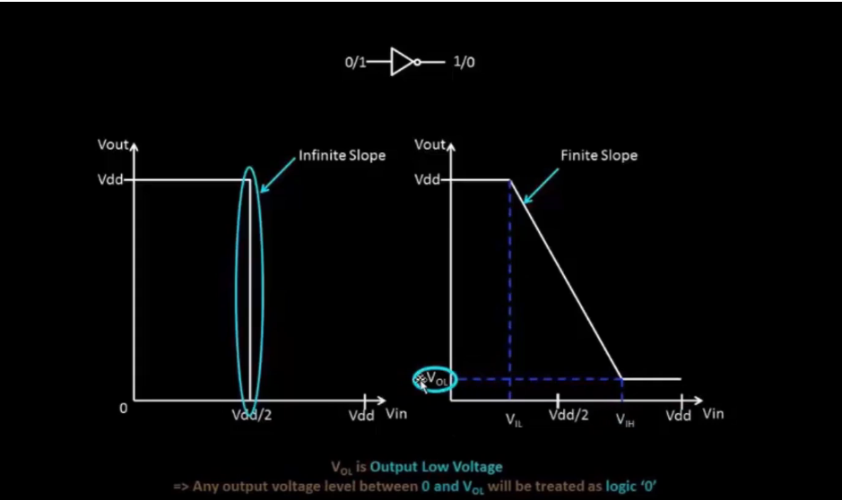
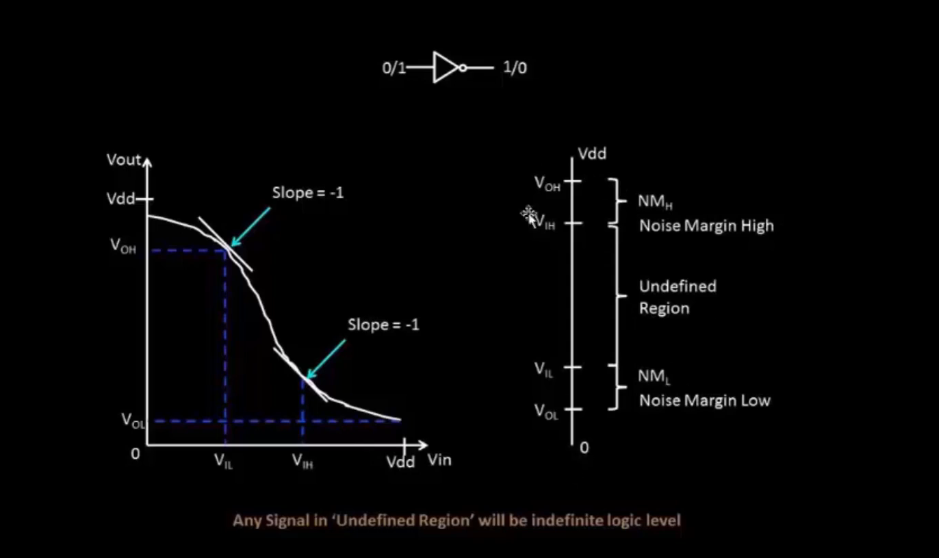
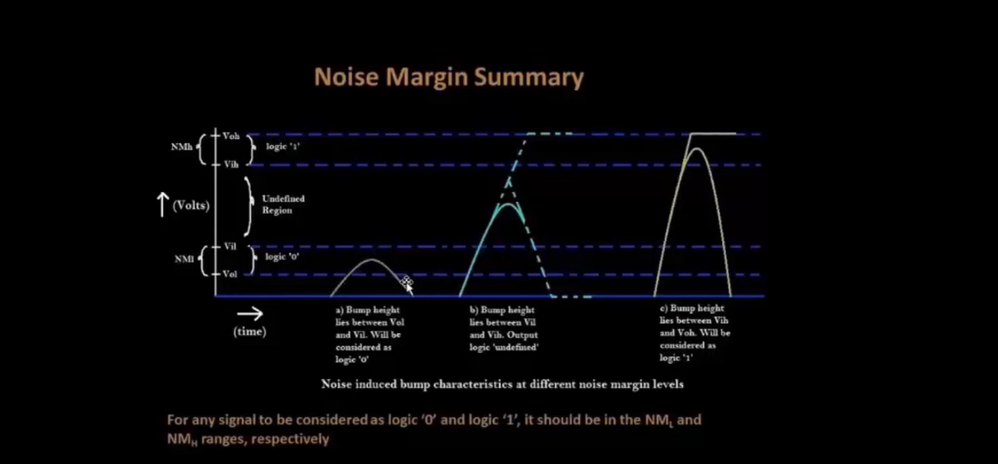
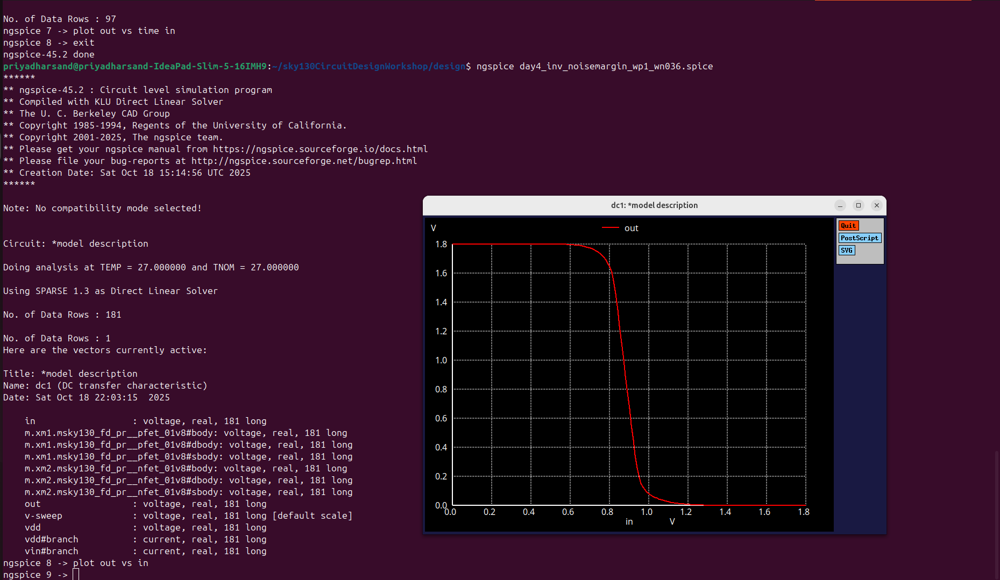

# VSD Hardware Design Program

## Static Behavior Evaluation: CMOS Inverter Robustness and Noise Margin

### `Introduction to noise margin`

**Noise Margin** is the measure of how much unwanted electrical noise a digital circuit — such as a CMOS inverter — can tolerate on its signal lines **without causing logic errors**.

In simple terms, it defines a **safety buffer** between the valid logic voltage levels (‘0’ and ‘1’) and the voltage levels that could cause a wrong interpretation.

Every digital signal can experience small voltage disturbances due to factors like electromagnetic interference, switching transients, or crosstalk between nearby wires. If these disturbances are small enough, the signal will still be read correctly. But if they become too large, they can push the voltage into an **undefined region**, where the circuit cannot clearly decide whether the signal is a logic ‘0’ or logic ‘1’.

The **Noise Margin** tells us **how much noise can be added to a signal** before this happens.

It is divided into two parts:
- **Noise Margin High (NMH)**: The maximum noise voltage that can be tolerated when the signal represents a logic ‘1’.  
- **Noise Margin Low (NML)**: The maximum noise voltage that can be tolerated when the signal represents a logic ‘0’.

A **larger noise margin** means the circuit is more robust and can operate reliably even in noisy environments. In CMOS digital design, maintaining high noise margins ensures stable logic levels, prevents bit errors, and improves the overall **reliability and integrity** of the system.


 

This image compares:

**Ideal I/O characteristic** of an inverter with **infinite slope** — abrupt switching at `Vdd/2` (left side)

**Actual inverter characteristic** with **finite slope** — gradual transition region (right side)

### `Noise Margin Definition — VTC and Undefined Region`

This figure illustrates how **Noise Margin** is derived from the **Voltage Transfer Characteristic (VTC)** of a CMOS inverter.

 

✅ The left plot shows:

The **Voltage Transfer Characteristic (VTC)** curve of a CMOS inverter illustrates how the output voltage (Vout) changes in response to variations in the input voltage (Vin).  
- The slope of the VTC becomes **−1** at two important points on the curve, which define the **critical switching thresholds** of the inverter:  
  - `VIL`: **Input Low Threshold Voltage** — the highest voltage at which the input is still recognized as logic ‘0’. Beyond this point, the output begins to transition from high to low.  
  - `VIH`: **Input High Threshold Voltage** — the lowest voltage at which the input is recognized as logic ‘1’. Below this point, the output starts transitioning from low to high.  

At these points, the inverter exhibits maximum gain, and the slope of −1 marks the boundary between stable and unstable logic regions.

---

✅ The right diagram shows:

The accompanying diagram illustrates both **input and output voltage levels** that define the inverter’s noise margins and operating regions.  
- **VOH** and **VOL** represent the **valid output logic levels**:  
  - `VOH`: Output High Voltage — close to the supply voltage (Vdd), representing logic ‘1’.  
  - `VOL`: Output Low Voltage — close to ground (Vss), representing logic ‘0’.  
- **VIL** and **VIH** denote the **input voltage thresholds** where the VTC slope equals −1.  
These values separate the valid logic regions from the undefined zone, helping designers identify safe operating levels for digital circuits.

---

✅ **Noise Margins**:

Noise margins quantify how much unwanted signal variation or electrical noise can be tolerated without causing logic errors.  
- `NMH = VOH − VIH`: **Noise Margin High** — represents the tolerance for noise when the output is at a high logic level (‘1’). A larger NMH indicates better immunity to noise that could falsely pull the signal low.  
- `NML = VIL − VOL`: **Noise Margin Low** — represents the tolerance for noise when the output is at a low logic level (‘0’). A larger NML ensures that small voltage spikes won’t incorrectly drive the signal high.  

Both NMH and NML are crucial design parameters that directly affect the reliability and robustness of CMOS circuits, especially when operating in noisy or high-speed environments.

---

✅ **Undefined Region**:

The **undefined region** exists between `VIL` and `VIH`, where the logic level cannot be clearly interpreted as ‘0’ or ‘1’.  
- Within this range, the inverter output becomes **unstable**, as both PMOS and NMOS transistors conduct simultaneously.  
- Any **input noise** falling inside this region can lead to unpredictable output states or oscillations, potentially causing logic errors.  
- Therefore, circuit designers strive to **maximize NMH and NML** by carefully selecting transistor sizing and supply voltages to widen the noise margin ranges and improve overall circuit **robustness and noise immunity**.

---

Noise margins are fundamental to ensuring **reliable logic operation** in real-world digital systems. They define how resilient a circuit is to disturbances, guaranteeing that even under electrical noise, voltage fluctuations, or crosstalk, the inverter continues to interpret and propagate logic levels correctly — maintaining stable and predictable digital performance.

### `Noise Margin Summary — Handling Input "Bumps"`

This figure summarizes how **Noise Margins** help handle noisy "bumps" on signals — ensuring correct logic detection.

 

✅ **Input thresholds**:

The **input threshold voltages** define the boundaries that determine how the inverter interprets an input signal as a valid logical ‘0’ or ‘1’.  
- `VIL`: When the input voltage is **less than approximately Vdd/2 (about 10% of Vdd)**, the signal is recognized as a **logic '0'**. In this region, the PMOS transistor (M1) is fully ON, and the NMOS transistor (M2) is OFF, ensuring the output remains at a high voltage (VOH).  
- `VIH`: When the input voltage is **greater than approximately Vdd/2 (about 90% of Vdd)**, the signal is recognized as a **logic '1'**. In this case, the NMOS transistor conducts strongly, pulling the output to a low voltage level (VOL).  

These input thresholds ensure a clear distinction between logic levels and prevent ambiguity in digital interpretation, providing a reliable interface between logic gates.

---

✅ **Output thresholds**:

The **output threshold voltages** determine the valid output levels that the inverter provides to the next stage in the digital circuit.  
- `VOL`: When the inverter output is close to **0V**, it is treated as a valid **logic '0'** by the subsequent gate. This state occurs when the NMOS transistor is ON and the PMOS transistor is OFF.  
- `VOH`: When the output voltage is close to **Vdd**, it is recognized as a valid **logic '1'**. This happens when the PMOS transistor is ON and the NMOS transistor is OFF.  

These levels are essential to guarantee that the inverter’s output can be correctly interpreted by the next stage in a digital system, preserving signal integrity across cascaded logic stages.

---

✅ **Noise bump scenarios**:

In real-world circuits, **noise or transient disturbances** can cause temporary fluctuations—known as **noise bumps**—on the signal line. The effect of these bumps depends on their amplitude and position relative to the defined voltage thresholds.

- **Case (a)**:  
  When the bump height lies **between `VOL` and `VIL`**, the signal is still interpreted as **logic '0'**. The noise is too small to push the signal into the undefined region, so the output remains stable.

- **Case (b)**:  
  When the bump height lies **between `VIL` and `VIH`**, the signal enters the **undefined or metastable region**. In this range, both transistors may conduct partially, and the circuit cannot confidently determine whether the input is a '0' or '1'. This leads to an **unstable or unpredictable output**, which can propagate errors in digital systems.

- **Case (c)**:  
  When the bump height lies **between `VIH` and `VOH`**, the signal is safely interpreted as **logic '1'**. The input voltage is high enough to keep the NMOS fully ON and the PMOS fully OFF, ensuring a solid low output or stable logic level transition.

---

✅ **Reliable signal interpretation**:

For any signal to be **reliably interpreted** as either **logic '0'** or **logic '1'**, it must remain **within the defined Noise Margin ranges (NML and NMH)**.  
- If the signal voltage stays **below VIL**, it is guaranteed to be read as logic '0' (within NML).  
- If the signal voltage stays **above VIH**, it is guaranteed to be read as logic '1' (within NMH).  
- Any voltage that falls **between VIL and VIH** enters the **undefined region**, where the logic state becomes unpredictable and may cause malfunction.

Maintaining signals within these boundaries is crucial for ensuring **noise immunity** and **robust operation** of CMOS digital circuits, preventing logic errors due to transient voltage disturbances or crosstalk in integrated systems.


### `Sky130 Noise margin labs`

<details> <summary><strong>day4_inv_noisemargin_wp1_wn036.spice </strong></summary>

```
*Model Description
.param temp=27


*Including sky130 library files
.lib "sky130_fd_pr/models/sky130.lib.spice" tt


*Netlist Description


XM1 out in vdd vdd sky130_fd_pr__pfet_01v8 w=1 l=0.15
XM2 out in 0 0 sky130_fd_pr__nfet_01v8 w=0.36 l=0.15


Cload out 0 50fF

Vdd vdd 0 1.8V
Vin in 0 1.8V

*simulation commands

.op

.dc Vin 0 1.8 0.01

.control
run
setplot dc1
display
.endc

.end
```
</details>

📈**plot the waveforms in ngspice**

```shell
ngspice day4_inv_noisemargin_wp1_wn036.spice
plot out vs in
```

Below image is the waveform of VTC curve to get the Noise Margin:

 

>🤔 **How to Calculate Noise Margin from SPICE VTC Plot ??**

In the interactive **ngspice VTC plot**, you can manually extract and analyze the **Noise Margin** parameters that define the reliability of a CMOS inverter’s switching behavior. The Voltage Transfer Characteristic (VTC) curve represents how the output voltage (Vout) varies with respect to the input voltage (Vin), and the noise margins are key indicators of how much unwanted noise the circuit can tolerate without changing its logic state.

1️⃣ **Click on PMOS slope** (left edge of the transition):  
At the left portion of the VTC curve, the PMOS transistor (M1) operates near its active region, and the output remains close to the logic high level. When you click on this left edge in the ngspice interactive plot, the terminal window displays the corresponding voltage coordinates:  
→ Terminal displays: `x0 = VIL`, `y0 = VOH`  
Here, **VIL** (Input Low Voltage) is the highest input voltage recognized as a logical low, and **VOH** (Output High Voltage) is the actual output voltage corresponding to logic high. These parameters define the point where the PMOS begins to turn off and the inverter transitions from high to low output.

2️⃣ **Click on NMOS slope** (right edge of the transition):  
On the right-hand side of the transition region, the NMOS transistor (M2) becomes dominant as it drives the output towards the low state. When you click on this right edge in the VTC plot, ngspice displays:  
→ Terminal displays: `x1 = VIH`, `y1 = VOL`  
Here, **VIH** (Input High Voltage) is the minimum input voltage recognized as a logical high, and **VOL** (Output Low Voltage) is the output voltage corresponding to the logic low level. This region shows where the NMOS turns fully on and the inverter output stabilizes at low voltage.

✅ **Noise Margin High (NMH)**:  
The **Noise Margin High** defines how much noise can be tolerated when the output is at the high logic level without being misinterpreted as a low input. It is calculated as:  
`NMH = VOH − VIH = y0 − x1`  
A larger NMH indicates stronger immunity to noise when the circuit output represents a logical ‘1’.

✅ **Noise Margin Low (NML)**:  
The **Noise Margin Low** represents the tolerance to noise when the output is at the low logic level, preventing false transitions to logic high. It is determined using:  
`NML = VIL − VOL = x0 − y1`  
A higher NML value signifies better noise resistance for the logic ‘0’ state.

Together, **NMH** and **NML** define the **noise immunity** of the CMOS inverter. During ngspice simulation, identifying `VIL`, `VIH`, `VOH`, and `VOL` from the VTC curve allows designers to ensure that the circuit performs reliably under real-world conditions, even in the presence of electrical noise or signal interference.
