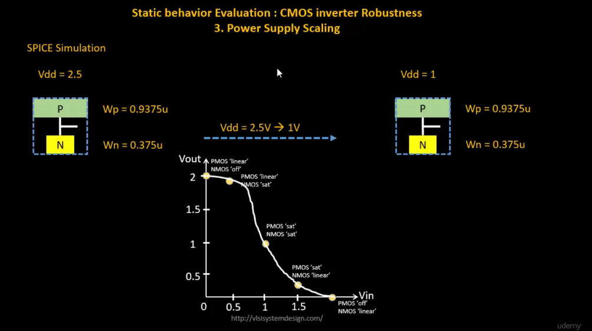
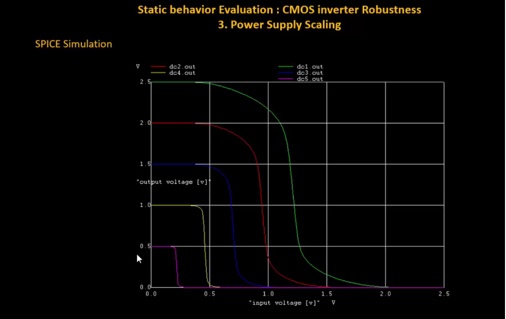
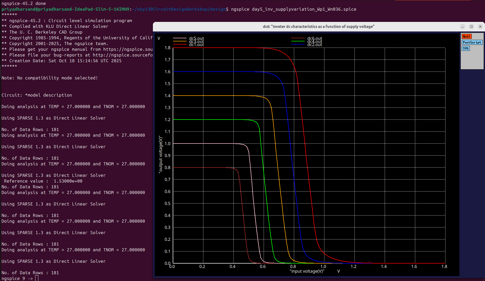
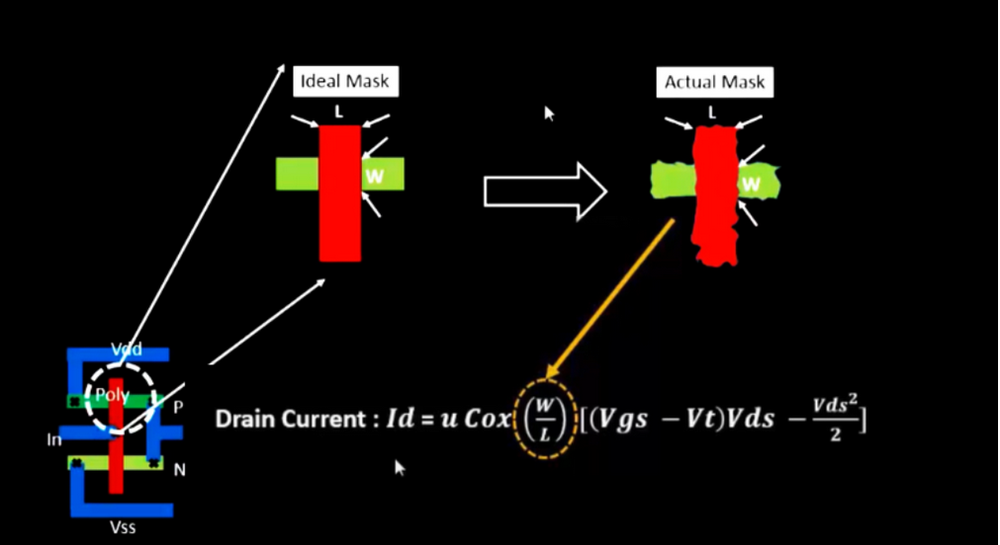
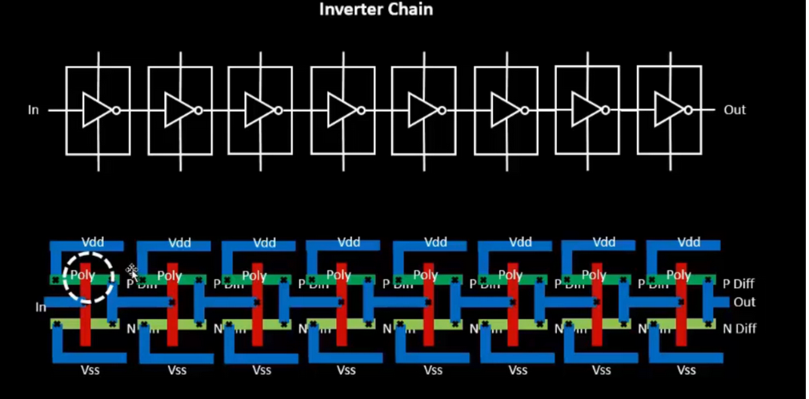
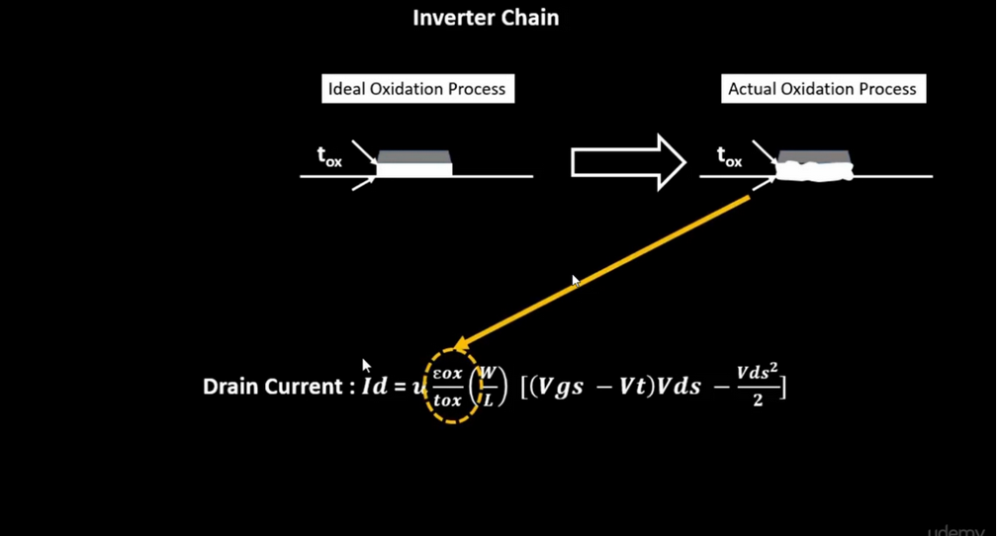
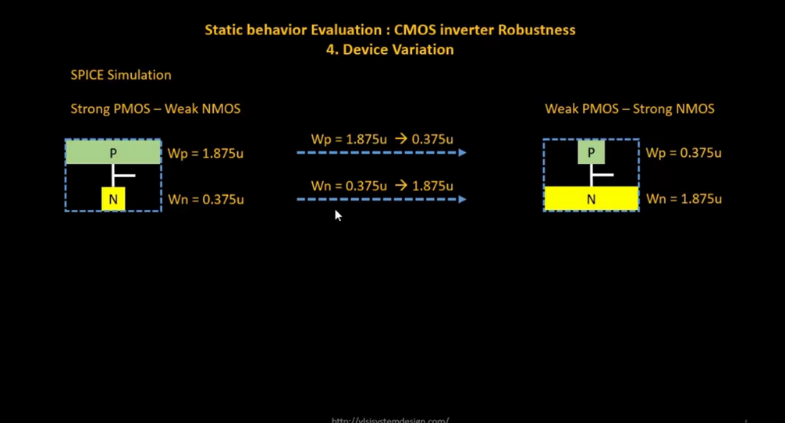
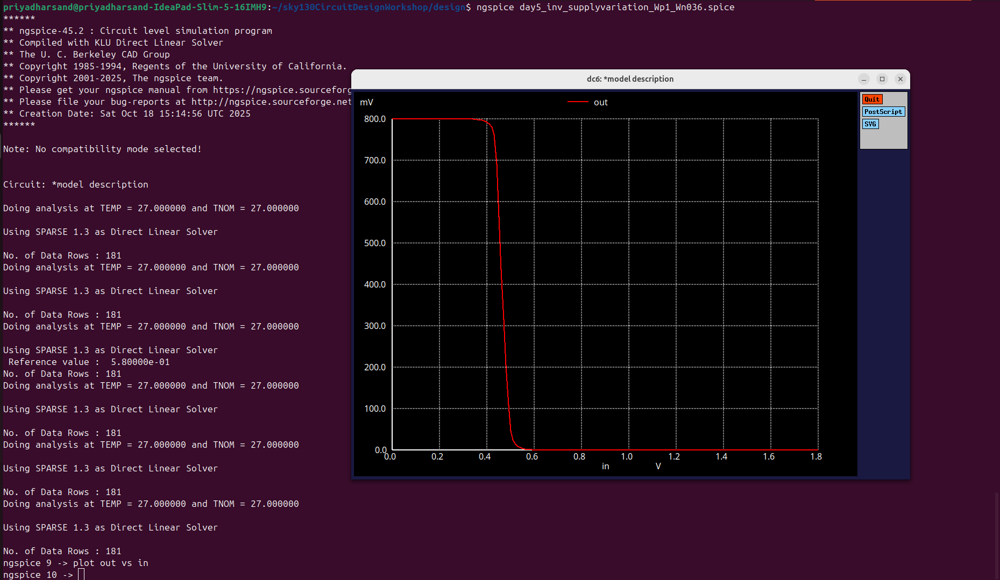

# VSD Hardware Design Program

## CMOS power supply and device variation robustness evaluation
    
### `Static behaviour evaluation — CMOS inverter robustness — Power supply variation`

**Overview:**

Power supply scaling has a significant impact on the **static characteristics** of a CMOS inverter. When the supply voltage (**Vdd**) is reduced, it directly influences the inverter’s **switching threshold (Vm)**, **noise margins (NMH and NML)**, and **robustness**.  
At higher supply voltages, the voltage difference between logic high and logic low levels is large, providing stronger drive strength, faster switching, and better noise immunity. However, as **Vdd is scaled down**, the inverter’s output voltage swing decreases, the switching threshold shifts, and noise margins shrink.  
This reduction makes the circuit more susceptible to noise and process variations, although it offers advantages such as lower power consumption and reduced heat dissipation — which are critical for modern low-power integrated circuits.

---

**SPICE Simulation:**

To analyze these effects, the CMOS inverter is simulated using **SPICE** at two different supply voltages:

- Initial condition: `Vdd = 2.5V`  
- Scaled condition: `Vdd = 1V`

The transistor dimensions are kept constant throughout the simulations to isolate the effect of voltage scaling on circuit behavior:
- **PMOS transistor width (Wp)** = 0.9375 μm  
- **NMOS transistor width (Wn)** = 0.375 μm  

By maintaining the same **W/L ratios**, the relative strength between the PMOS and NMOS devices remains unchanged, ensuring that any observed variation in performance is solely due to the change in supply voltage.

During simulation:
- The **VTC (Voltage Transfer Characteristic)** is obtained for both supply voltages.
- The **switching threshold (Vm)** is identified as the point where `Vin = Vout`.
- **VOH, VOL, VIH, and VIL** values are extracted to compute **NMH** and **NML**.

As `Vdd` decreases from 2.5V to 1V:
- The **output voltage swing** reduces (VOH becomes smaller, VOL may slightly rise).
- The **switching threshold (Vm)** shifts closer to mid-supply voltage.
- Both **Noise Margins** (NMH and NML) decrease, indicating reduced noise immunity.

This experiment demonstrates that while lowering supply voltage conserves power, it also compromises the inverter’s static performance — a key trade-off in **low-power CMOS design**.


 

✅ **Switching Threshold (Vm)**:  
As `Vdd` decreases, the inverter's switching threshold **Vm** tends to move toward the center of the supply range — but noise margins shrink.

✅ **Noise Margins**:  
Lower `Vdd` → reduced noise immunity → circuit becomes more sensitive to noise and supply variations.

✅ **Performance Impact**:  
Low `Vdd` operation reduces static and dynamic power — but limits noise robustness.  
High `Vdd` improves noise margin, but increases power dissipation.

While power scaling is essential for low-power design, it introduces trade-offs in noise margin and reliability — requiring careful balancing in circuit design.

This plot illustrates how the **Voltage Transfer Characteristics (VTC)** of a CMOS inverter shift with **different power supply levels (Vdd scaling)** — showing progressive reduction in noise margins as Vdd decreases.

 

**Advantages of using 0.5V supply:**

Using **lower Vdd (0.5V)** provides benefits like **~50% gain improvement** and **~90% reduction in energy consumption**, demonstrating the efficiency of power supply scaling in CMOS inverters.

**Disadvantage of using 0.5V supply**:

- While lowering Vdd improves gain and energy efficiency, it introduces **performance impact** — circuits may switch slower due to reduced drive strength.

### `Sky130 Supply Variation Labs`

<details> <summary><strong>day5_inv_supplyvariation_Wp1_Wn036.spice</strong></summary>

```
*Model Description
.param temp=27

*Including sky130 library files
.lib "sky130_fd_pr/models/sky130.lib.spice" tt

*Netlist Description

XM1 out in vdd vdd sky130_fd_pr__pfet_01v8 w=1 l=0.15
XM2 out in 0 0 sky130_fd_pr__nfet_01v8 w=0.36 l=0.15

Cload out 0 50fF

Vdd vdd 0 1.8V
Vin in 0 1.8V

.control

let powersupply = 1.8
alter Vdd = powersupply
let voltagesupplyvariation = 0
dowhile voltagesupplyvariation < 6
    dc Vin 0 1.8 0.01
    let powersupply = powersupply - 0.2
    alter Vdd = powersupply
    let voltagesupplyvariation = voltagesupplyvariation + 1
end

plot dc1.out vs in dc2.out vs in dc3.out vs in dc4.out vs in dc5.out vs in dc6.out vs in xlabel "input voltage(V)" ylabel "output voltage(V)" title "Inverter dc characteristics as a function of supply voltage"

.endc

.end
```
</details>

📈**plot the waveforms in ngspice**

```shell
ngspice day5_inv_supplyvariation_Wp1_Wn036.spice
```

Below image is waveform for different supplies:

 

🤔**How to Calculate Gain from SPICE VTC Plot??**

To calculate the gain of the CMOS inverter from the Voltage Transfer Characteristics:

1️⃣ **Click on PMOS slope** (left side of transition) — Terminal displays:  
`x0 = Vin`, `y0 = Vout`

2️⃣ **Click on NMOS slope** (right side of transition) — Terminal displays:  
`x1 = Vin`, `y1 = Vout`

3️⃣ **Compute Gain**:

Gain = (y0 − y1) / (x0 − x1)

### `Static behaviour evaluation-CMOS inverter robustness-Device variation`

#### Device Variation and CMOS Inverter Robustness

**Device variation** is one of the key factors that define the robustness of a CMOS inverter. Variations can occur due to:

- **Etching Variation**
- **Oxide Thickness Variation**

### `Etching Variation`

**Etching** is one of the most critical steps in semiconductor fabrication. It is responsible for shaping and defining the **physical geometry** of components in a CMOS layout — particularly the **Width (W)** and **Length (L)** of transistors. These dimensions determine how transistors switch and conduct current, making precise etching essential for consistent circuit performance.

---

#### **Fabrication Deviations**

During the etching process, small deviations often occur between the **intended design dimensions** and the **actual fabricated structures** due to process limitations, material properties, and equipment precision. These deviations affect key regions of the transistor:

- **P-diffusion region** → defines the **width of the PMOS gate**  
- **N-diffusion region** → defines the **width of the NMOS gate**  
- **Poly-silicon layer thickness** → defines the **gate length (L)**, which corresponds to the specific **technology node** (e.g., 20 nm, 30 nm, 45 nm).  

Etching variations can also influence:
- **Metal interconnect layers**
- **Contact holes and vias** that connect different layers of the chip.

---

#### **Impact on Device Performance**

Even small variations in transistor dimensions can significantly affect circuit behavior:

- The **actual Width (W)** and **Length (L)** after fabrication may differ from their ideal or designed values.  
- The **drain current (Id)** in a MOSFET is directly proportional to `(W/L)`. Therefore, any deviation in W or L changes the drive current.  
- This leads to variations in key CMOS inverter characteristics, such as:
  - **Switching Threshold (Vm)** — the point where the inverter switches states.  
  - **Noise Margins (NMH and NML)** — the ability to tolerate noise without logic errors.  
  - **Overall performance and robustness** — including speed, power, and stability.

---

#### **Summary**

The image illustrating **etching variation** shows the mismatch between the **ideal mask design** and the **actual fabricated structure**.  
- In the **ideal mask**, transistor dimensions are perfectly defined.  
- In the **fabricated chip**, **W** and **L** may slightly deviate due to over-etching or under-etching.  

These dimensional variations directly influence **transistor current, delay, and noise tolerance**, making etching precision a crucial factor in achieving **high-performance and reliable CMOS circuits**.

 

This image shows an **Inverter Chain** — a sequence of multiple CMOS inverters connected in series.  
The bottom view illustrates the **physical layout** of each inverter in the chain, showing key layers:  
Poly (Gate), P-Diffusion, N-Diffusion, VDD, VSS.  
Such chains are commonly used to study **delay**, **robustness**, and **variations** across multiple stages of logic.

 

### `Oxide Thickness Variation`

During MOSFET fabrication, there is often a difference between the **ideal oxide thickness** of the gate and the **actual oxide thickness** achieved.

Since **I<sub>d</sub>** depends on **C<sub>ox</sub>** (oxide capacitance), any variation in oxide thickness directly impacts the drain current (I<sub>d</sub>), thereby affecting the performance of the CMOS inverter.

The image below illustrates the difference between **ideal** and **actual** oxide thickness during fabrication:

 

These **two minimal variations** — *etching variation* (impacting W and L) and *oxide thickness variation* — play a key role in defining the **robustness** of CMOS inverters.

Next, let's perform a **sweep of the PMOS and NMOS widths** as shown below:

 

### `Transistor Strength Definitions:`

- **Strong PMOS**:
  - Lower resistance PMOS — provides an easier path to charge the output capacitor.
  - Achieved by using a **wider PMOS**.

- **Weak NMOS**:
  - Higher resistance NMOS — since **resistance is inversely proportional to area**.
  - Achieved by using a **narrower NMOS**.

- **Weak PMOS**:
  - Higher resistance PMOS.
  - Achieved by using a **narrower PMOS**.

- **Strong NMOS**:
  - Lower resistance NMOS.
  - Achieved by using a **wider NMOS**.

### `Sky130 Device Variation Labs`

<details> <summary><strong>day5_inv_supplyvariation_Wp1_Wn036.spice</strong></summary>

```
*Model Description
.param temp=27

*Including sky130 library files
.lib "sky130_fd_pr/models/sky130.lib.spice" tt

*Netlist Description

XM1 out in vdd vdd sky130_fd_pr__pfet_01v8 w=7 l=0.15
XM2 out in 0 0 sky130_fd_pr__nfet_01v8 w=0.42 l=0.15

Cload out 0 50fF

Vdd vdd 0 1.8V
Vin in 0 1.8V

*simulation commands
.op

.dc Vin 0 1.8 0.01

.control
run
setplot dc1
display
.endc

.end
```
</details>

📈**plot the waveforms in ngspice**

```shell
ngspice day5_inv_supplyvariation_Wp1_Wn036.spice
plot out vs in
```

Below image is output waveform of device variation:

 

As the **PMOS width** is larger than the **NMOS width**, the PMOS provides a stronger pull-up path — causing the output to stay high for a longer duration when compared to the NMOS curve.

