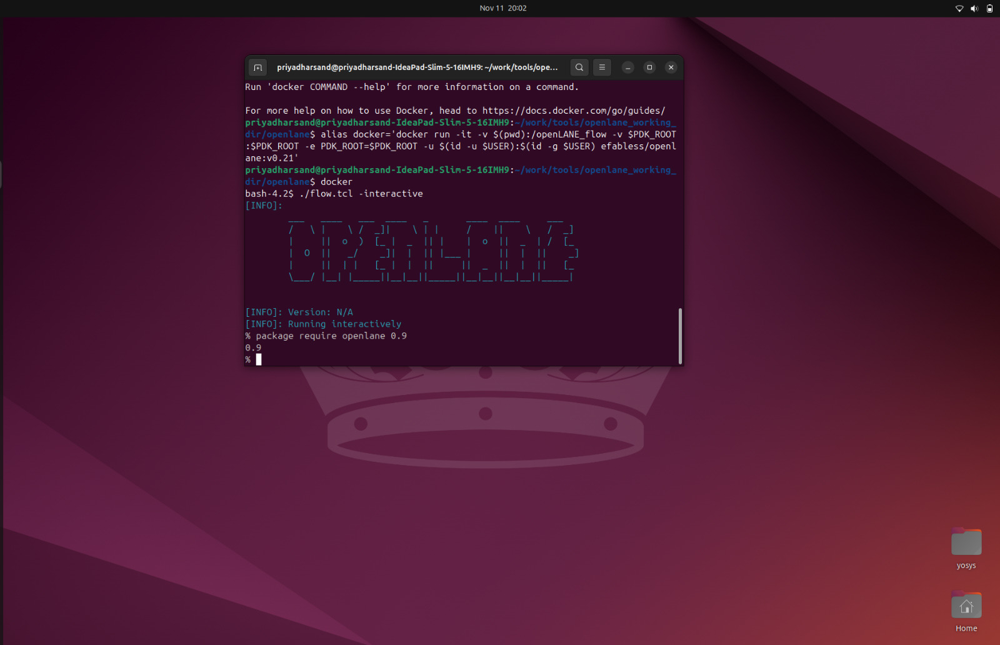
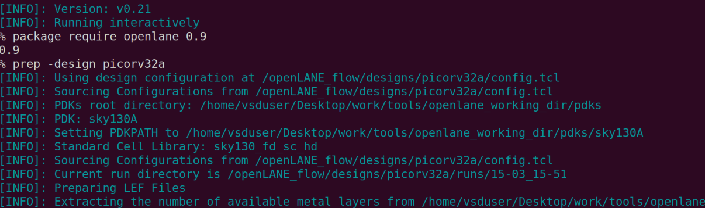
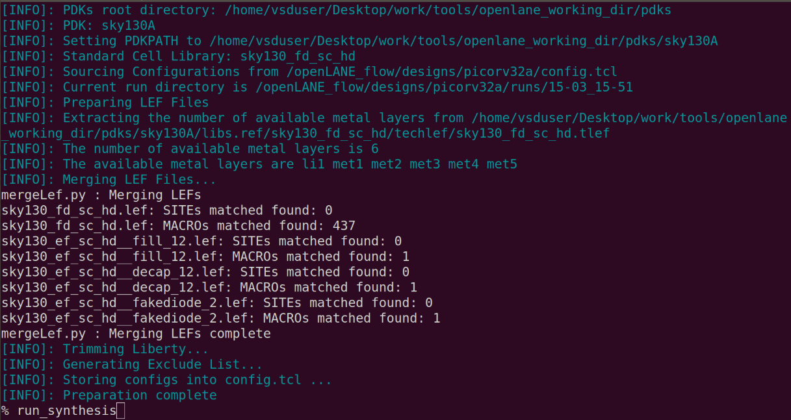
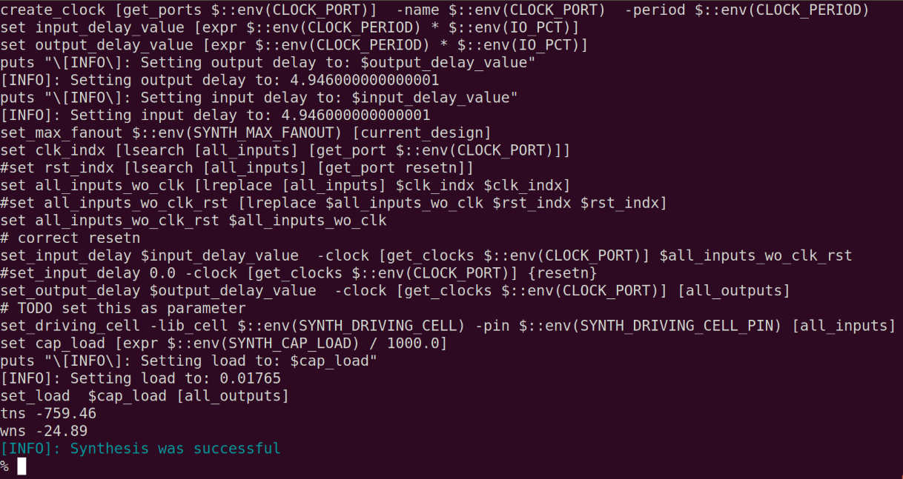
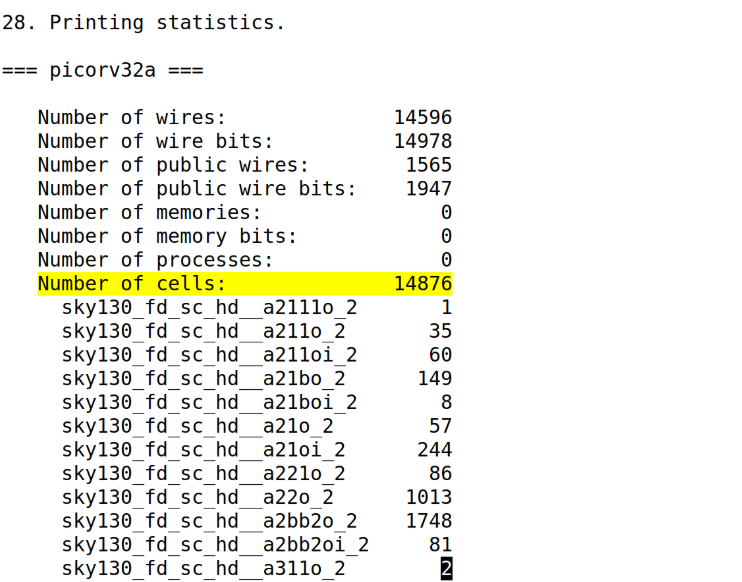

# 🚀 Day 1 — Kickoff to Open-Source ASIC Design using OpenLANE and Sky130 PDK

### 🧩 RISC-V Reference SoC Tapeout Program — Week 6 (Physical Design Journey)

## Introduction

Today I began my open-source ASIC design journey. I explored how real chips are designed — from writing hardware logic to generating layouts ready for fabrication. This day focused on understanding the OpenLANE flow, the SkyWater 130 nm process (Sky130), and how both together form a complete RTL → GDSII pipeline.

## ASIC Design Flow (High level)

An ASIC (Application-Specific Integrated Circuit) is a chip designed for a dedicated purpose. The typical RTL-to-GDSII flow:

- RTL Design — Hardware behavior described in Verilog
- Synthesis — Convert RTL into gates using standard cells
- Floorplanning — Define chip area, power network, and I/O locations
- Placement — Physically arrange logic cells
- CTS (Clock Tree Synthesis) — Build the clock network for sequential elements
- Routing — Connect everything with metal interconnects
- Sign-off — Ensure timing and physical-rule compliance
- GDSII Export — Produce final layout for fabrication

In short: the RTL-to-GDSII flow turns digital logic into a physical silicon layout.

## Rise of Open-Source EDA

Traditionally, ASIC design relied on expensive commercial tools. Today, open-source EDA projects make chip design accessible:

- Synthesis: Yosys
- Floorplanning / Placement / Routing: OpenROAD / TritonRoute
- Clock Tree Synthesis: TritonCTS
- DRC/LVS: Magic, Netgen
- Static Timing Analysis: OpenSTA
- Layout Viewer: KLayout

OpenLANE ties these tools together and automates the full flow.

## OpenLANE Overview

OpenLANE is an open-source RTL-to-GDSII automation platform built to work with the SkyWater 130 nm open PDK (sky130). It:

- Runs inside a Docker container for reproducibility
- Automates the entire flow or individual stages
- Integrates Yosys, OpenROAD, Magic, TritonCTS, OpenSTA, etc.
- Produces reports and artifacts for each stage

## SkyWater 130 nm PDK (sky130)

The Sky130 PDK is a public process design kit providing:

- Device models (transistors)
- Layout layers and mapping
- Design rules for DRC/LVS
- Standard cell libraries (e.g., sky130_fd_sc_hd)

The PDK is the bridge between EDA tools and fabrication.

## Understanding Synthesis

Synthesis converts RTL into a gate-level netlist mapped to the chosen standard cell library. During synthesis:

- Logic is optimized and mapped to real cells
- Area, timing, and cell usage are estimated
- Reports show cell counts and resource distribution

Yosys is used for synthesis within OpenLANE.

## Practical Session — Running the Flow

Step 1 — Launch OpenLANE
- Enter the OpenLANE directory and start the OpenLANE environment (typically inside the provided Docker container).
- Note: The exact invocation depends on how you set up OpenLANE. The usual flow is to use the repository's README instructions to start the container and then run `./flow.tcl -interactive` from inside the container.

Example:
```bash
cd ~/work/tools/openlane_working_dir/openlane
# follow the repository README to run the container, then:
./flow.tcl -interactive
package require openlane 0.9
```

Step 2 — Prepare the Design
- I used the picorv32a RISC-V core as the reference design.
- Preparation sets up configuration files, libraries, and the directory structure.


Command:
```bash
prep -design picorv32a
```

After preparation, `designs/picorv32a/runs/` is created and contains run data, scripts, and logs.

Step 3 — Run Synthesis
Command:
```bash
run_synthesis
```

Synthesis reports are stored under:
`runs/<date_time>/reports/synthesis/`

I opened the synthesis report, e.g.:
```bash
less runs/30-10_08-35/reports/synthesis/1-yosys_4.stat.rpt
```

### Interpreting the Synthesis Report
The synthesis report contains stats like:
- Number of wires and cells
- Counts of different logic gates
- Area estimation
- Flip-flop (DFF) count

From my run:
- Total Cells: 14,876
- D Flip-Flops: 1,613

Flop ratio (fraction of sequential elements):
Flop Ratio = 1,613 / 14,876 ≈ 0.1084 ≈ 10.84%

This flop ratio helps understand how much of the design is sequential versus combinational.

## Key Commands Used

- docker — Start the OpenLANE Docker environment (follow repo-specific instructions)
- ./flow.tcl -interactive — Enter interactive OpenLANE session (inside container)
- package require openlane 0.9 — Load OpenLANE toolset inside TCL
- prep -design picorv32a — Initialize and configure design files
- run_synthesis — Run Yosys synthesis
- less <report path> — View synthesis report

## Summary of Learnings

- ASIC Flow: Converts RTL to a physical layout ready for fabrication
- OpenLANE: Open-source automation platform for RTL→GDSII
- Sky130 PDK: Open process kit defining fabrication rules and standard cells
- Synthesis: Maps Verilog to technology-specific cells using Yosys
- Reports: Provide counts (cells, flops), area estimates, and timing hints
- Flop Ratio: Useful metric for sequential vs combinational density and for timing strategies

## What's Next?
Day 2 — Floorplanning and Library Cells
- Explore floorplanning: chip area, utilization, and power grid planning
- Learn how floorplan decisions affect timing and manufacturability
- Visualize floorplan and early layout in Magic after running the floorplanning stage in OpenLANE
