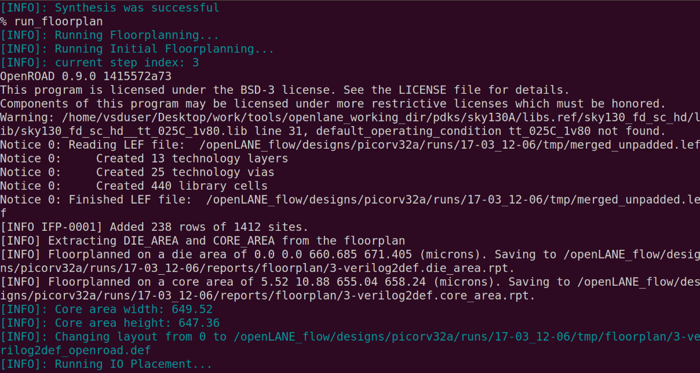
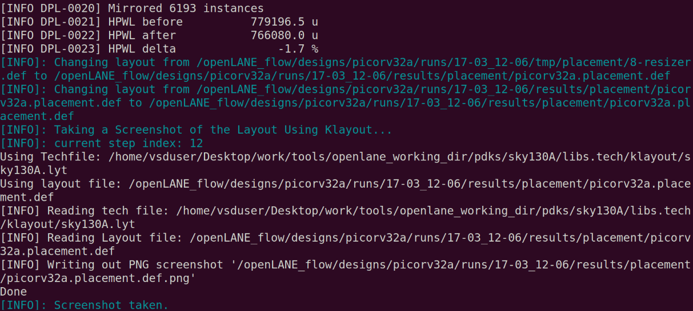
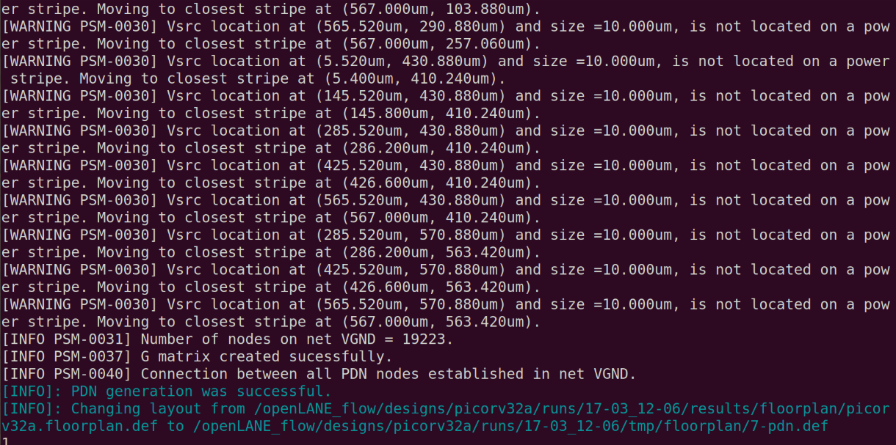
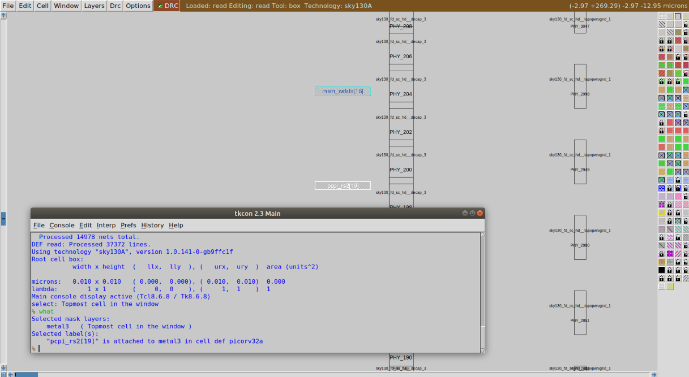
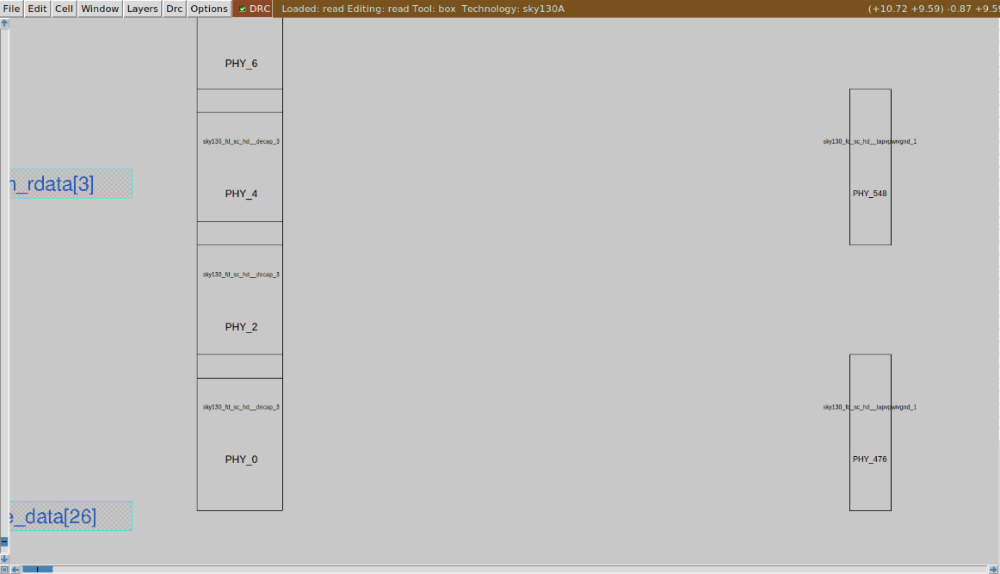
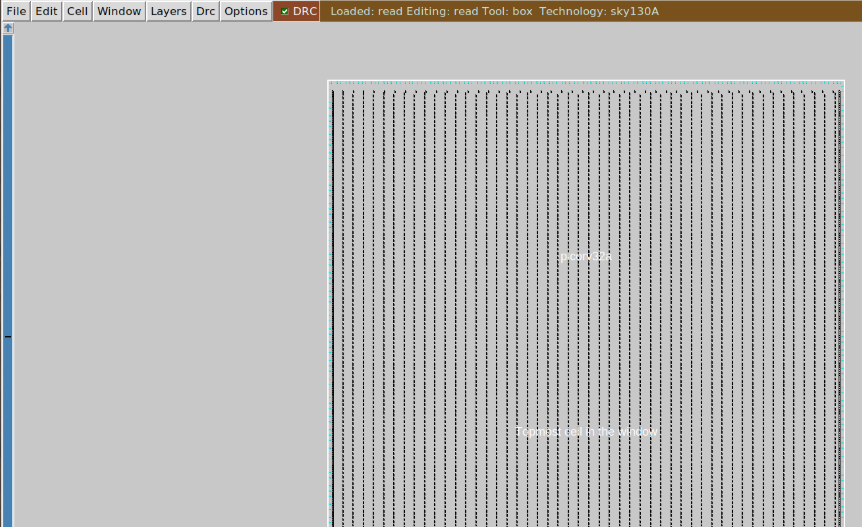
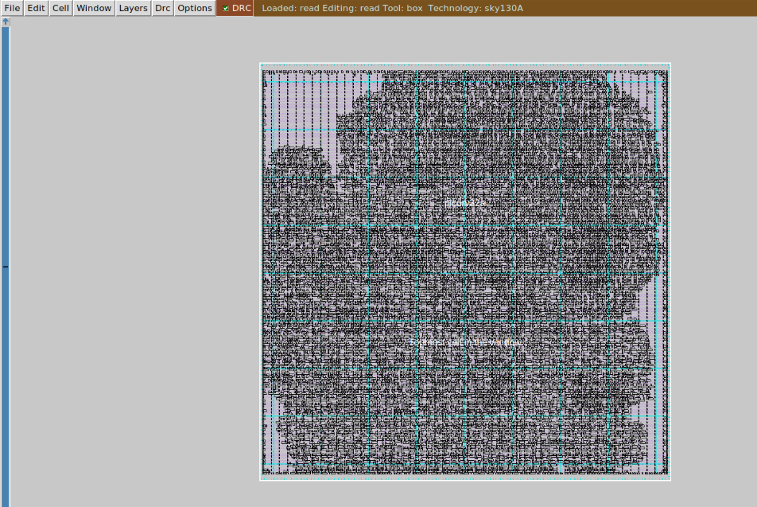

# Day 2 — Floorplanning & Standard-Cell Libraries (Practical Guide)

Short version
You finished synthesis on Day 1. Today you’ll floorplan the core, generate power straps and pins, visualize the DEF in Magic, run placement, and review how standard cells are designed and characterized. This file is a compact, task-oriented runbook with copyable bash commands and a small helper script.

1 — What we want to achieve (outcomes)
1. Produce a usable floorplan DEF: <design>.floorplan.def
2. Inspect die/core dimensions and pin coordinates
3. Visualize floorplan in Magic
4. Run placement to produce <design>.placement.def
5. Understand standard-cell characterization outputs (.lib, .lef, .spice)

2 — Quick references (parameters)
- Utilization Factor = Standard Cell Area / Core Area — target: 50%–70%
- Aspect Ratio = Core Height / Core Width — prefer near 1.0
- DEF units in OpenLANE: typically 1000 units = 1 μm

3 — Task list (step-by-step)

Step A — Start OpenLANE (do this inside your host terminal; follow repo README for Docker run)
1. cd to the openlane repo
2. start container and enter interactive TCL
3. load the OpenLANE package

Commands:
```bash
cd ~/work/tools/openlane_working_dir/openlane
# start Docker per repository instructions, then inside the container:
./flow.tcl -interactive
package require openlane 0.9
```

Step B — Prepare design and run synthesis (one-time per design)
Goal: create run directory and synth reports
```bash
prep -design picorv32a
run_synthesis
```

Outputs:
- designs/picorv32a/runs/<run_dir>/
- runs/<run_dir>/reports/synthesis/ (yosys reports, cell counts, flop counts)

Step C — Run floorplan
Goal: generate <design>.floorplan.def (core/die, pins, power, tapcells)
```bash
run_floorplan
```


Look for log messages like:
- Creating Core Area
- Inserting Tapcells & Decaps
- Generating Pin Placement
- Floorplan completed successfully

Step D — Inspect DEF: die area and conversions
Example DEF excerpt:
```
DIEAREA ( 0 0 ) ( 660685 671405 )
```
Interpretation:
- DEF units: 1000 units = 1 μm
- Width = 660.685 μm
- Height = 671.405 μm
- Area ≈ 443,587 μm²

Step E — Visualize floorplan in Magic
1. cd into the floorplan results folder
2. invoke magic with sky130 tech, merged.lef, and the DEF file

Commands:
```bash
cd designs/picorv32a/runs/<run_dir>/results/floorplan/
magic -T $PDK_ROOT/sky130A/libs.tech/magic/sky130A.tech \
      lef read ../../tmp/merged.lef \
      def read picorv32a.floorplan.def &
```

Files used:
- sky130A.tech — technology file for Magic
- merged.lef — cell footprints and abstracts
- picorv32a.floorplan.def — floorplan geometry and pins

Step F — Run placement
Goal: create <design>.placement.def
Phases: global placement → detailed placement (legalize → optimize)
Command:
```bash
run_placement
```


Step G — Visualize placement in Magic (same pattern)
```bash
cd designs/picorv32a/runs/<run_dir>/results/placement/
magic -T $PDK_ROOT/sky130A/libs.tech/magic/sky130A.tech \
      lef read ../../tmp/merged.lef \
      def read picorv32a.placement.def &
```
4 — Pin placement & strategies (short notes)
- Uniform: pins spaced along chip edges — simple and balanced
- Clustered: group related pins (e.g., high‑speed buses) to reduce routing length
- Place timing-critical pins near corresponding macros or power domains

5 — Power planning quick notes
- Add an outer power ring and inner straps (VDD/VSS)
- Choose strap pitch and widths based on estimated current density
- Insert tapcells regularly to tie wells and reduce substrate noise
- Place decoupling caps (decaps) near clusters of switching logic or near I/O pads if required

6 — Standard-cell design and characterization (overview)
Flow:
Specification → Schematic → SPICE verification → Layout → DRC/LVS → Extraction → SPICE corners → Characterization → Generate LEF / .lib / .spice

Characterization outputs used by tools:
- LEF: physical abstract for placement and routing
- Liberty (.lib): timing and power tables for synthesis/STA
- SPICE netlist: transistor-level verification and characterization

7 — Useful files produced in the flow
- <design>.floorplan.def — core/die/pins/power
- merged.lef — footprints and macros
- <design>.placement.def — per-cell coordinates
- reports/synthesis/* — Yosys statistics
- <run_dir>/results/placement/*, /floorplan/* — def/lef pairs for visualization

8 — Commands (bash) — one block for easy copy/paste
```bash
# inside container
cd ~/work/tools/openlane_working_dir/openlane
./flow.tcl -interactive
package require openlane 0.9

# prepare and synthesize
prep -design picorv32a
run_synthesis

# floorplan and placement
run_floorplan
run_placement

# visualize floorplan
cd designs/picorv32a/runs/<run_dir>/results/floorplan/
magic -T $PDK_ROOT/sky130A/libs.tech/magic/sky130A.tech \
      lef read ../../tmp/merged.lef \
      def read picorv32a.floorplan.def &

# visualize placement
cd designs/picorv32a/runs/<run_dir>/results/placement/
magic -T $PDK_ROOT/sky130A/libs.tech/magic/sky130A.tech \
      lef read ../../tmp/merged.lef \
      def read picorv32a.placement.def &

# exit
exit
exit
```

9 — Small helper script (save as run_day2.sh; run inside OpenLANE interactive shell)
```bash
#!/usr/bin/env bash
set -euo pipefail
DESIGN="picorv32a"

echo "Prep design ${DESIGN}..."
prep -design "${DESIGN}"

echo "Synthesis..."
run_synthesis

echo "Floorplan..."
run_floorplan

echo "Placement..."
run_placement

echo "Finished. Inspect results in designs/${DESIGN}/runs/<run_dir>/results/"
```

10 — Troubleshooting tips (common issues)
- If DEF shows unexpectedly small core: check config.tcl core size and utilization settings.
- If Magic can't read tech or LEF: ensure PDK_ROOT is exported and points to a valid sky130 PDK.
- If placement fails due to congestion: reduce utilization or increase core area; re-run floorplan with different utilization target.
- If DRC/LVS errors appear for custom cells: run DRC/LVS on each cell in Magic and verify netlist extraction before characterization.

11 — Summary (one-paragraph)
Today you turned synthesis output into a physical floorplan and placement DEF, inspected die size and pins, visualized both floorplan and placement in Magic, and reviewed the flow for standard-cell characterization (.lib/.lef/.spice). Keep utilization around 50–70%, aim for a near-square core, and iterate floorplan/placement together until congestion and timing look acceptable.

12 — Next steps (Day 3)
- Create a CMOS inverter layout in Magic
- Run DRC/LVS and extraction
- Simulate transistor-level netlist in ngspice across corners
- Characterize cell and generate LEF and Liberty (.lib) entries for the cell library

If you want, I can now:
- produce a formatted README.txt version (plain text) of this same content,
- generate a GitHub issue checklist for the Day 2 tasks,
- or create the Day 3 inverter walkthrough next (Magic + ngspice steps).
