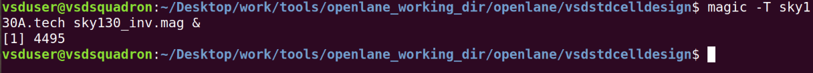
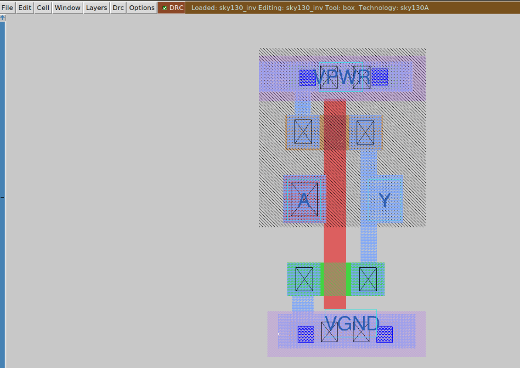
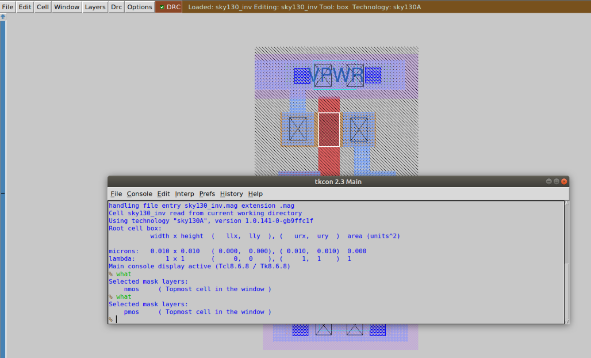
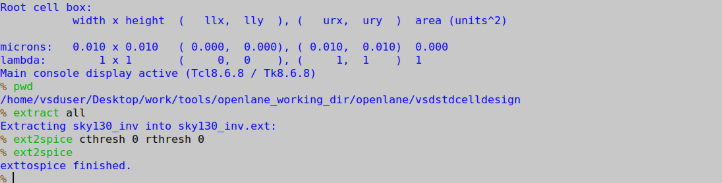
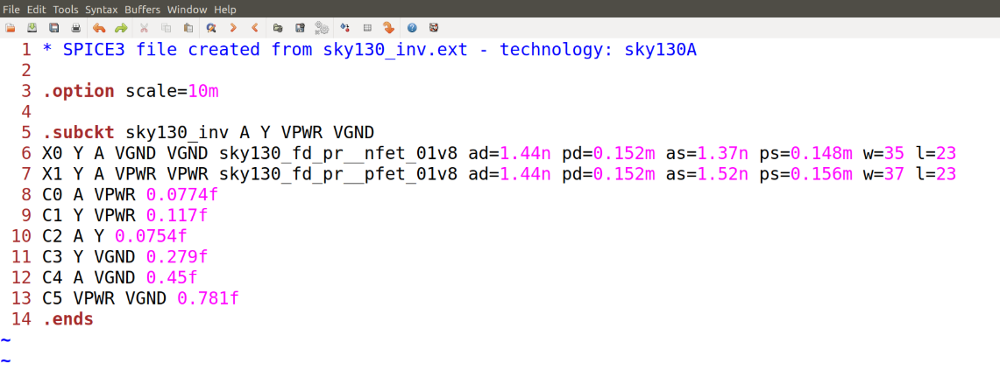
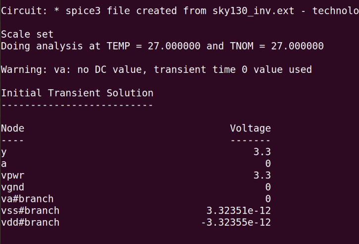
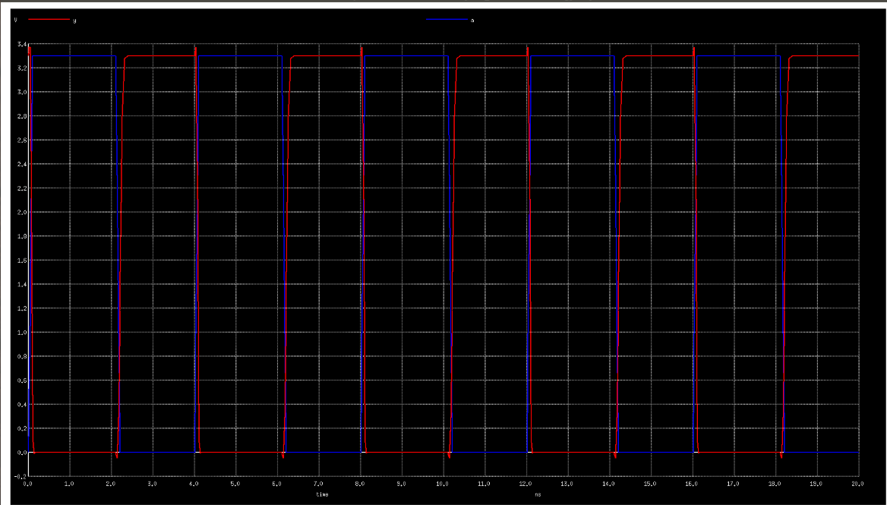
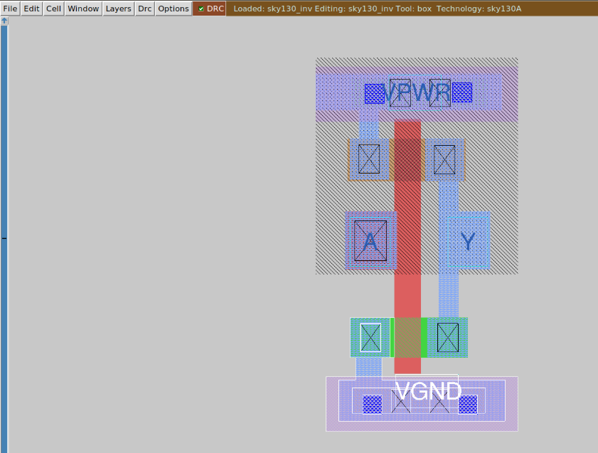

# ⚙️ Day 3 — Custom Standard Cell Design using Magic & NGSPICE Characterization

Welcome to Day 3 of the Physical Design Track — we design, verify and characterize a CMOS inverter using Magic (layout) → ext2spice (extraction) → NGSPICE (simulation). This guide preserves all original content and reorganizes it into a clean, developer-friendly UI with quick commands, checklists, collapsible examples, and helpful troubleshooting tips.

---

## Table of Contents
- Overview
- Quick Checklist
- Full Step-by-step Flow (with commands)
  - Environment & repo setup
  - Open layout in Magic
  - Run DRC in Magic
  - Extract SPICE netlist (ext2spice)
  - Prepare SPICE testbench
  - Run NGSPICE transient and measure
  - Re-run DRC & final verification
- Example SPICE testbench (ready-to-edit)
- Example run script (batch ngspice)
- DRC example output (collapsible)
- Troubleshooting & Notes
- Design Flow Recap
- Key Learnings
- What I prepared for you
- Next step

---

## Overview
We walk through the standard-cell creation pipeline:
1. Layout design (Magic) → produce `.mag`.
2. DRC verification (Magic) → DRC-clean layout.
3. Netlist extraction (Magic ext2spice) → `.ext` & `.spice`.
4. Circuit simulation (NGSPICE) → transient waveforms and measured delays.
5. Final DRC check (Magic) → verified, tapeout-ready cell.

This guide uses Sky130 process rules (sky130A.tech) and example SPICE/testbench snippets to get you running quickly.

---

## Quick Checklist
- [ ] Clone the standard cell repo
- [ ] Copy Sky130 techfile into the working folder
- [ ] Open layout in Magic (`magic -T sky130A.tech sky130_inv.mag &`)
- [ ] Run DRC and fix any violations
- [ ] Run `extract all` and `ext2spice`
- [ ] Add power, stimulus and `.measure` statements to SPICE
- [ ] Run NGSPICE (batch) and collect measurements
- [ ] Re-run DRC to confirm no new violations

---

## Full Step-by-step Flow (commands)

### 1) Environment & repository setup
```bash
# Go to OpenLANE working directory
cd Desktop/work/tools/openlane_working_dir/openlane

# Clone the standard cell design repo
git clone https://github.com/nickson-jose/vsdstdcelldesign

# Enter the cloned repository
cd vsdstdcelldesign

# Copy the technology file from Sky130 PDK (adjust path as needed)
cp /home/vsduser/Desktop/work/tools/openlane_working_dir/pdks/sky130A/libs.tech/magic/sky130A.tech .

# Verify setup
ls -la
```

This ensures Magic recognizes the Sky130A process rules for layout verification.

---

### 2) Open the inverter layout in Magic (graphical)
```bash
magic -T sky130A.tech sky130_inv.mag &
```
Magic opens with the sky130A.tech rules applied and displays layout layers (diffusion, poly, metal, etc.) for inspection and editing.

---

### 3) Perform Design Rule Check (DRC)
In the Magic (Tcl) console:
```tcl
tech load sky130A.tech
drc check
drc why
```
Common sample output:
- Transistor width < 0.42um (diff/tap.2)

Fix spacing/width/overlap violations in layout and re-run `drc check` until there are no errors.

---

### 4) Extract SPICE netlist from layout (in Magic)
After layout is DRC-clean:
```tcl
# Extract devices and connectivity
extract all

# Include parasitic resistance and capacitance; set thresholds
ext2spice cthresh 0 rthresh 0

# Generate the SPICE netlist (creates a .spice file)
ext2spice

Magic's ext2spice converts drawn geometry into device instances and parasitic caps/resistors. Save the produced `.spice` output — this is the starting point for NGSPICE.

---

### 5) Editing SPICE for simulation (testbench)
Open the generated `.spice` file and add/merge a testbench that defines:
- Power supplies (VDD/VSS)
- Input PULSE waveform
- Load/parasitic capacitors (from ext2spice)
- `.tran` analysis
- `.measure` statements to compute tpLH, tpHL, trise, tfall

Example final SPICE setup (kept below in Example SPICE testbench section).

---

### 6) Transient Simulation in NGSPICE
Run:
```bash
ngspice sky130_inv.spice
```
After ngspice loads:
- Use `plot V(Y)` or `plot V(Y) vs time V(A) vs time` interactively
- Or run ngspice in batch mode and capture `.measure` outputs (sample run script provided below)

The plot should show input transitions and inverted output. Use `.measure` results to find:
- Rise time (tr)
- Fall time (tf)
- Propagation delays (tpLH, tpHL)

---


### 7) Reverification in Magic (final DRC)
After any layout edits:
```tcl
tech load sky130A.tech
drc check
drc why
```
Expected final output:
```
No errors found.
```
When DRC-clean and functional timing is acceptable, the cell is ready for characterization and .lib/LEF generation.

---

## Example SPICE testbench (editable)
Use this as a basis; replace model includes, transistor lines and parasitic caps with exact ext2spice output when available.

```spice
* SPICE simulation file for CMOS inverter - technology: sky130A
* Example testbench: replace model includes and device params with ext2spice output

.options scale=0.01u
.option numdgt=12

* --- PDK model includes (update paths as needed) ---
.include libs/pshort.lib
.include libs/nshort.lib

* --- Devices (example: replace with ext2spice device lines) ---
* These M* lines are placeholders; use the exact transistor lines generated by ext2spice
M1 Y A VPWR VPWR pshort_model.0 w=37u l=23u
+ ad=1443 pd=152 as=1517 ps=156
M2 Y A VGND VGND nshort_model.0 w=35u l=23u
+ ad=1435 pd=152 as=1365 ps=148

* --- Power supplies and input stimulus ---
VDD VPWR 0 3.3
VSS VGND 0 0
Va A VGND PULSE(0 3.3 1n 0.1n 0.1n 2n 4n) ; small delay to ensure measurement windows

* --- Example parasitic capacitances (replace with ext2spice output) ---
CO A Y 0.05f
C1 Y VPWR 0.11f
C2 A VPWR 0.07f
C3 Y 0 2f
C4 VPWR 0 0.59f

* --- Simulation control ---
.tran 0.2n 40n uic
.control
run
echo "---- MEASURED VALUES ----"
meas tpLH = tpLH
meas tpHL = tpHL
meas trise = trise
meas tfall = tfall
.endc

* --- Timing measurements (trigger on input crossing VDD/2 ~1.65V) ---
.measure tran tpLH TRIG V(A) VAL=1.65 RISE TARG V(Y) VAL=1.65 RISE
.measure tran tpHL TRIG V(A) VAL=1.65 FALL TARG V(Y) VAL=1.65 FALL

* --- Output rise/fall times (10% to 90% of VDD ~= 0.33V to 2.97V) ---
.measure tran trise TRIG V(Y) VAL=0.33 RISE TARG V(Y) VAL=2.97 RISE
.measure tran tfall TRIG V(Y) VAL=2.97 FALL TARG V(Y) VAL=0.33 FALL

.end
```

---

## Example run script (batch ngspice)
Save as `run_sim.sh`, make executable, and run to capture `.measure` output in `ngspice_run.log`.

```bash
#!/usr/bin/env bash
# Helper script to run ngspice in batch mode and extract measures
SPICE_FILE="sky130_inv.spice"

if ! command -v ngspice &> /dev/null; then
  echo "ngspice not found in PATH. Install or add it to PATH."
  exit 2
fi

if [ ! -f "$SPICE_FILE" ]; then
  echo "SPICE file $SPICE_FILE not found."
  exit 3
fi

# Run ngspice in batch mode and capture output
OUTFILE="ngspice_run.log"
ngspice -b -o "$OUTFILE" "$SPICE_FILE"

# Show the full ngspice log
echo "=== ngspice log (last 200 lines) ==="
tail -n 200 "$OUTFILE"

# Extract .measure results (lines with "measure" or values)
echo
echo "=== Parsed measures ==="
grep -E '^\s*(tpLH|tpHL|trise|tfall)\s*=' "$OUTFILE" || echo "No explicit measure lines found; check ngspice output."

if ! grep -q -E '^\s*(tpLH|tpHL|trise|tfall)\s*=' "$OUTFILE"; then
  echo
  echo "Full ngspice output (for debugging):"
  cat "$OUTFILE"
fi

exit 0
```

---

## DRC example output (collapsible)
<details>
<summary>Example DRC messages & interpretation</summary>

- Transistor width < 0.42um (diff/tap.2)  
  Meaning: The drawn diffusion/tap width is below PDK minimum. Increase diffusion/poly width or adjust layout.

- Spacing violation between metals  
  Meaning: Metal traces drawn too close. Increase spacing or route on a different track.

- Via enclosure or cut count errors  
  Meaning: Add required enclosure overlaps, or use the correct via stack defined by the PDK.

</details>

---

## Troubleshooting & Notes
- Missing .include libraries: set absolute or correct relative paths to the PDK model `.lib` files. Example:
  `.include /path/to/pdks/sky130A/libs.ref/BSIM/.../pshort.lib`
- Node name mismatches: ext2spice may name nets differently — ensure the testbench refers to the same nodes (A, Y, VPWR, VGND).
- If ext2spice produces separate parasitic files, merge them into the testbench or use `.include ext_spice_file.spice`.
- If ngspice fails to find models, ensure the `.include` statements are valid and that model files are compatible with your ngspice version.

---

## Design Flow Recap (compact)
Stage | Description | Tool | Output
---|---:|:---:|:---
1 | Clone and setup repo | Shell, Git | Project initialized
2 | Open layout | Magic | .mag file
3 | Run DRC | Magic | Initial violations → fix
4 | Extract netlist | Magic | .spice file
5 | Add testbench | Text editor | Modified SPICE with .measure
6 | Run transient sim | NGSPICE | Input/output waveforms + metrics
7 | Final DRC | Magic | DRC clean layout

---

## Key Learnings
- Magic Layout: open-source layout editor for custom cells.
- DRC Verification: enforces foundry rules to produce a manufacturable layout.
- SPICE Extraction: converts geometry into transistor/capacitor/resistor networks.
- NGSPICE Simulation: provides switching behavior, timing, rise/fall times, and parasitic-aware performance.
- Characterization: measured delays drive .lib generation for place-and-route and STA.

---

## What I prepared for you
- Reformatted your Day 3 content into a clean, GitHub-style markdown with:
  - Table of contents and quick checklist
  - Clear command blocks for Magic & NGSPICE
  - Example SPICE testbench and run script (to be adapted with ext2spice output)
  - Troubleshooting and DRC examples
Everything from your original content is preserved and presented with improved structure and UX for a reader following the lab.

---

## Next step
I’ve organized the guide and provided editable example files for the NGSPICE testbench and a batch-run script. Paste the ext2spice output here (or point me to the ext2spice `.spice` file), and I will merge it into the testbench: that will produce a ready-to-run SPICE file and an updated run script that prints clean, parsed timing results.

```
