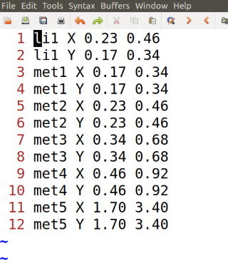
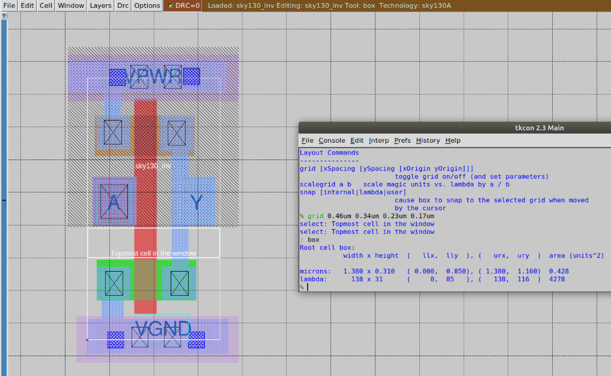
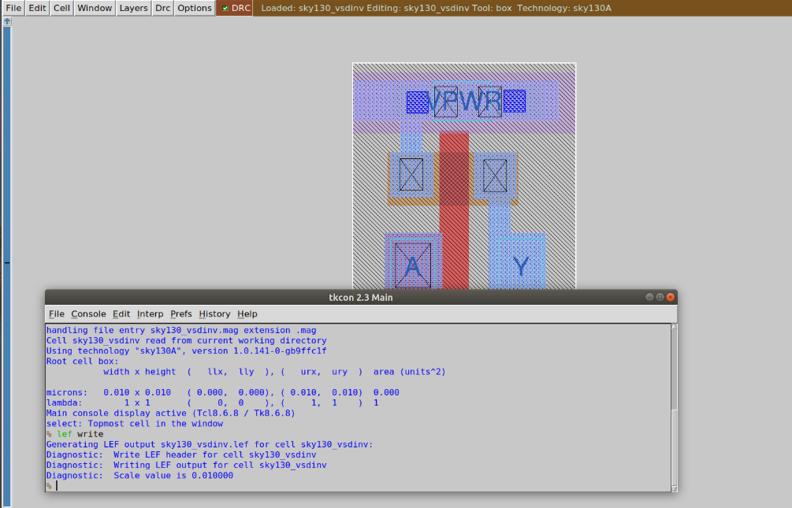
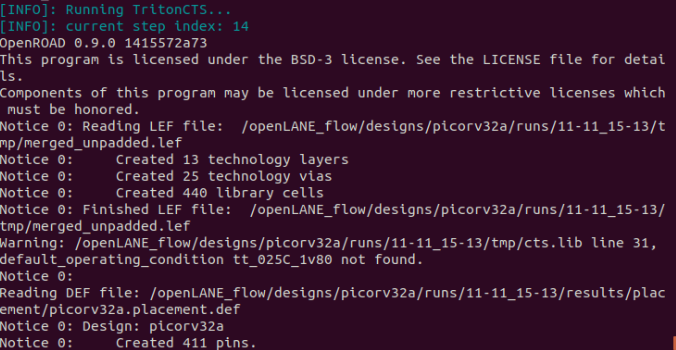
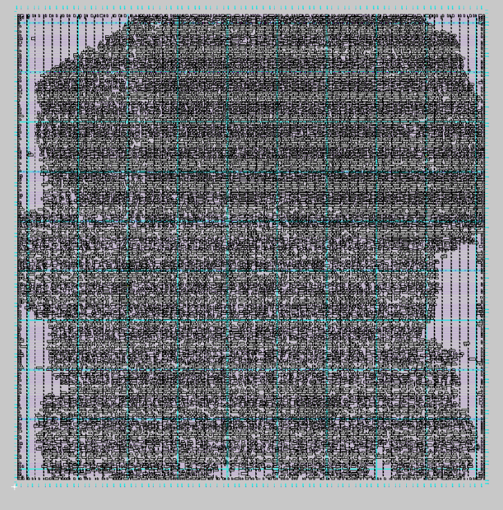

# ⏱️ Day 4 — Pre-Layout Timing Analysis and Importance of a Good Clock Tree
🧩 RISC-V Reference SoC Tapeout Program — Week 6

Welcome to Day 4 of the RISC-V SoC Tapeout Program.
In this session, we go beyond basic logic design and focus on timing, clock distribution, and Static Timing Analysis (STA) using OpenSTA and TritonCTS.

These steps ensure the design not only works functionally but also meets timing closure before fabrication.

🧱 1. Understanding Timing and Clock Tree Essentials

Timing defines when data moves through a circuit.
Even a correct logic design can fail if the clock and data signals don’t align properly.

Concept	Meaning
Setup Time	Minimum time data must stay stable before the clock edge
Hold Time	Minimum time data must stay stable after the clock edge
Clock Skew	Difference in clock arrival time between two flip-flops
Clock Jitter	Tiny variation in the clock edge due to noise or process effects

A well-designed clock tree delivers the clock signal evenly to all flip-flops, keeping skew and jitter minimal.

🔁 Timing Flow — Simplified
graph TD
A[Design Netlist] --> B[Define Clock Constraints]
B --> C[Run OpenSTA (Pre-CTS)]
C --> D[Clock Tree Synthesis (TritonCTS)]
D --> E[Post-CTS OpenSTA]
E --> F[Timing Closure Achieved]

⚙️ 2. Converting Custom Cell to LEF for Integration

Before a standard cell can be used in synthesis, it must be abstracted into a LEF (Library Exchange Format).
LEF keeps physical info (pins, size, layers) but removes transistor-level details.

🧩 Aligning to Routing Tracks

Each foundry defines routing grids using a tracks.info file.
Pins and rails should align with these grids to simplify routing.

Layer	Direction	Offset	Pitch
met1	X	0.24	0.48
met1	Y	0.16	0.34

🧰 Steps to Export LEF from Magic
magic -T sky130A.tech sky130_inv.mag
lef write sky130_inv.lef

✅ Make sure:

Cell height matches the power rails (VPWR/VGND).

Pins lie at grid intersections.

Layout is DRC-clean before export.

⏱️ 3. Timing Libraries and Delay Modeling

Timing information is stored in .lib (Liberty) files.
They describe delay, power, and logical behavior for each cell.

File	Purpose
.lib	Timing, power, and logic info
.lef	Physical geometry and pins
.mag	Magic layout format
.spice	Device-level electrical netlist
📊 Example Delay Table
Slew (ns) → / Load (fF) ↓	5	10	15
0.05	0.02	0.05	0.09
0.10	0.04	0.08	0.12

These tables help the synthesis and STA tools calculate timing accurately.

🧩 4. Static Timing Analysis with OpenSTA

OpenSTA checks all paths in a circuit for setup and hold timing.
It works both before and after the clock tree is inserted.

🧰 Running OpenSTA
sta config.tcl

Inside config.tcl:

read_liberty sky130_fd_sc_hd__tt_025C_1v80.lib
read_verilog design.v
link_design <top_module>
create_clock -period 10 [get_ports clk]
report_checks -path_delay min_max

📈 Key Timing Metrics
Parameter	Description
WNS (Worst Negative Slack)	Most critical timing violation
TNS (Total Negative Slack)	Total sum of violations
Setup Slack	Margin before the clock edge
Hold Slack	Margin after the clock edge

If slack < 0, it means the design fails to meet timing.

🧭 5. Clock Tree Synthesis (CTS) with TritonCTS

After placement, the clock network is built using TritonCTS.
It adds clock buffers automatically in a balanced H-tree structure.

🧰 Command
run_cts

📊 Post-CTS Timing Check

After building the clock tree, analyze again:

sta post_cts.conf

Observe:

Reduced skew

Updated buffer delays

Real setup/hold margins

⚡ 6. Fixing Timing Violations
Issue	Possible Fix
Setup violation	Increase clock period / use faster cells
Hold violation	Insert small delay buffers
Skew imbalance	Re-run CTS with balanced settings
High TNS	Re-synthesize with stricter timing

🔄 7. Complete Timing Analysis Flow
flowchart LR
A[RTL Synthesis (Yosys)] --> B[Pre-CTS STA (OpenSTA)]
B --> C[Clock Tree Synthesis (TritonCTS)]
C --> D[Post-CTS STA (OpenSTA)]
D --> E[Optimization (Yosys/OpenROAD)]
E --> F[Timing Closure Achieved]

Stage	Tool	Output
Synthesis	Yosys	Netlist
Pre-CTS STA	OpenSTA	Ideal clock report
CTS	TritonCTS	Buffered clock DEF
Post-CTS STA	OpenSTA	Real clock report
Optimization	OpenROAD	Slack-fixed design
🧠 8. Key Takeaways
Concept	Summary
LEF Abstraction	Converts layout into a reusable cell view
Timing Libraries	Store delay & power data
OpenSTA	Performs static timing before and after CTS
TritonCTS	Builds balanced clock trees
Slack Metrics	Tell whether the design meets timing closure
✅ 9. Conclusion

In Day 4, you learned to:

Export a custom cell into a LEF format

Understand timing libraries and delay tables

Run OpenSTA for pre-layout timing checks

Build a clock tree using TritonCTS

Verify timing closure post-CTS

With a balanced clock tree and verified timing, the design is now ready for routing and final sign-off.

🔗 Next Step

➡️ Day 5 — Final Steps for RTL-to-GDS using TritonRoute and OpenSTA
You’ll explore how detailed routing is completed and how post-layout timing ensures a sign-off-ready chip.------------------dont change the content keep as it is and keep all the graph as well
