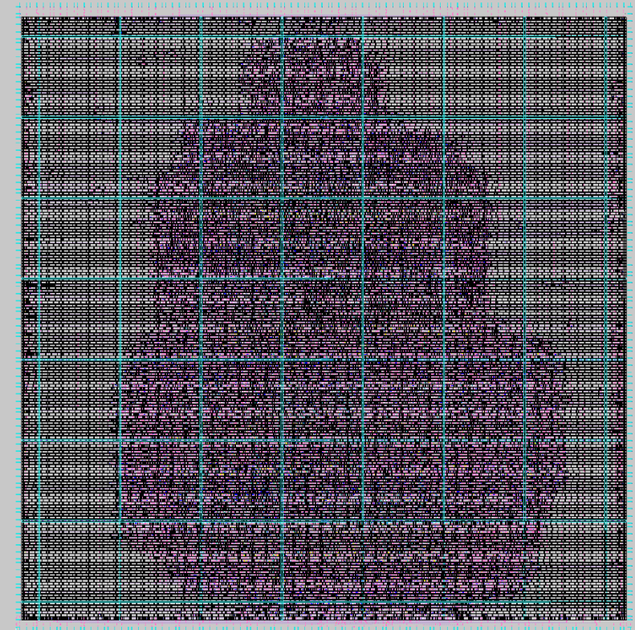

# ⚙️ Day 5: Final Steps in RTL-to-GDS using TritonRoute and OpenSTA
## 🧩 RISC-V Reference SoC Tapeout Program

## Welcome to Day 5 of Week 6 in the RISC-V SoC Tapeout Program!
This day marks the culmination of the Physical Design (PD) flow, where our chip finally transitions from a logical netlist to a fabrication-ready layout (GDSII).

After building the floorplan, performing placement, and constructing the clock tree, our next focus areas are:

Creating a robust Power Distribution Network (PDN)

Connecting all interconnects through Routing (using TritonRoute)

Validating physical correctness through Design Rule Check (DRC)

Extracting parasitic effects using SPEF

Running post-route Static Timing Analysis (STA) with OpenSTA

Think of this as the “final quality check” before sending your chip design to the fab!

### ⚡ 1. Generation of Power Distribution Network (PDN)
🧠 What is PDN?

The Power Distribution Network (PDN) acts like the electrical grid of your chip.
Just as cities need power lines, substations, and transformers to deliver electricity to every house,
a chip needs metal rails and straps to supply stable VDD (power) and VSS (ground) to every standard cell.

If power doesn’t reach a region properly, the circuit can behave unpredictably — like a city blackout!
Hence, PDN ensures uniform power delivery, minimal voltage drop (IR drop), and noise reduction.

### ⚙️ PDN in OpenLANE Flow

In traditional ASIC flows, PDN is often created before placement,
but in OpenLANE, PDN generation happens after Clock Tree Synthesis (CTS) —
this ensures the clock buffers placed during CTS are also properly connected to the power grid.

When you run:

gen_pdn


OpenLANE internally invokes OpenROAD’s PDN generator,
which automatically draws horizontal and vertical metal stripes and vias across layers (usually M3–M5).

Each standard cell’s VDD/VSS pins connect to these rails, forming a uniform grid.
The result is like a city-wide power grid, distributing electricity evenly across every street (cell row).

### 📊 PDN Generation Output
<div align="center">  </div>

In this visualization, you can see the metal grid lines spanning horizontally and vertically —
these form the power highways that keep your chip alive during operation.

### 🚀 2. Routing using TritonRoute
🧭 Purpose of Routing

After placement and CTS, all cells are positioned,
but their input/output pins are not yet physically connected.
Routing connects every logical net with actual metal wires and vias,
turning the abstract connectivity graph into real conductive paths.

It’s like laying roads between houses and offices so people (signals) can travel smoothly!

### 🧩 Routing Flow Overview

TritonRoute — the open-source detailed router in OpenLANE — performs this job in two main stages:

Global Routing – creates approximate route “guides” between source and destination pins,
like planning roads on a city map.

Detailed Routing – follows these guides to draw exact metal wires,
ensuring no overlaps, no spacing violations, and no open connections.

⚙️ Command to Run Routing
run_routing


This triggers TritonRoute’s multi-step process:

Pin Access Analysis → Finds valid routing entry points for each pin.

Track Assignment → Decides which metal tracks will carry each net.

Detailed Routing → Draws wires and vias along predefined tracks.

Search & Repair → Iteratively fixes DRC violations (shorts, spacing issues, etc.).

The result is a DRC-clean, fully connected layout ready for parasitic extraction.


Left: Global route guides (rough connections)

Right: Detailed routing (actual metal traces and vias)

### 🔍 Real-World Analogy

Think of routing as laying roads and bridges in a city:

Global routing is like drawing highways on a map.

Detailed routing is the actual construction — defining lanes, intersections, and flyovers.

Search and repair is the city inspector ensuring no roads overlap or break traffic rules (DRC).

### 🧮 3. SPEF File Generation
🧠 What is SPEF?

SPEF (Standard Parasitic Exchange Format) represents resistances and capacitances of interconnect wires after routing.
Every metal wire and via introduces a small delay — just like how longer, thinner roads slow down vehicles due to friction and congestion.

These parasitic effects affect signal timing, skew, and power consumption, so accurate modeling is critical.

### ⚙️ Command for SPEF Extraction
cd <path-to-SPEF_EXTRACTOR-tool-directory>
python3 main.py <path-to-LEF-file> <path-to-DEF-file-created-after-routing>


This tool parses the layout (.lef, .def) and generates a .spef file describing each net’s RC network.

A portion of the output looks like this:


💡 Real-Life Analogy

Imagine each wire as a pipe carrying water:

Resistance (R) is like the narrowness of the pipe.

Capacitance (C) is like water stored along the walls of the pipe.
Both affect how fast signals (water) can travel.

SPEF captures all these values so that tools like OpenSTA can perform accurate post-route timing analysis.

### 🧩 4. Design Rule Check (DRC)
🧠 Why DRC Matters

Every semiconductor foundry defines strict manufacturing rules —
minimum spacing, via sizes, line widths, etc. — to ensure the layout can be fabricated reliably.

DRC (Design Rule Check) ensures the design respects all these geometric constraints.
Violating even one rule can cause short circuits, open connections, or lithography failures on silicon.

🧰 How DRC Works

TritonRoute includes a built-in DRC engine that checks for:

Rule Type	Description
Spacing Violations	Ensures wires aren’t too close
Width Violations	Ensures minimum metal thickness
Via Overlaps	Prevents shorts between layers
Open/Short Checks	Verifies all nets are properly connected

If errors are found, TritonRoute automatically enters a Search-and-Repair loop until all violations are fixed.

Only a DRC-clean layout can move forward to GDSII export for tapeout.

🔍 Analogy

Think of DRC as a building safety inspection:

The architect (you) designs the chip.

TritonRoute builds it.

The DRC inspector ensures every wall, wire, and via follows the construction code —
no wires too close, no illegal shapes, and no weak spots!

### 🧠 5. Recap of TritonRoute Features
Feature	Description
1. Route Guide Compliance	Follows the global routing guides accurately
2. Inter-layer Connectivity	Manages vias between metal layers
3. Search & Repair	Automatically fixes violations iteratively
4. Built-in DRC Engine	Ensures manufacturability of layout
5. Routing Optimization	Reduces congestion and improves signal timing
📏 6. Post-Route Timing Validation using OpenSTA

Once routing and parasitic extraction are complete, we re-run Static Timing Analysis (STA) —
but this time with the .spef file that includes real wire delays.

⚙️ Command
sta post_route_sta.tcl


This checks:

Setup and hold timing across all paths

Clock skew and latency

Signal delay variations due to RC parasitics

🧠 Analogy

Before routing, STA assumes all wires are ideal (like teleportation).
After routing, STA uses SPEF — now it knows how far signals actually travel,
just like accounting for traffic, road length, and turns instead of straight-line distances.

This ensures our timing closure reflects real silicon behavior, not an idealized model.

### 🏁 Conclusion — Week 6 Summary

By the end of Week 6, we’ve completed every crucial step of Physical Design, transforming our logic-level RISC-V SoC into a fabrication-ready GDSII layout.

### ✅ Achievements:

Generated Power Distribution Network (PDN)

Completed Routing with TritonRoute

Performed Design Rule Check (DRC)

Extracted SPEF parasitics

Conducted Post-route STA using OpenSTA

Each step reflects what real semiconductor companies like Intel, TSMC, and SkyWater do before sending a chip to fabrication.----dont change contents 
```
