# 🟦 RISC-V SoC Tapeout Program — Week 7️⃣


---

<div align="center">

# 🚀 Week 7 — End-to-End RTL-to-GDS Flow with OpenROAD

🌟 This is **Week 7** of the **VSD RISC-V SoC Tapeout Program** —

I transitioned from **manual stage-wise physical design** to **full automation** using **OpenROAD-Flow-Scripts (ORFS)**.

I successfully set up the **ORFS environment**, integrated the **VSDBabySoC design**, and executed the **complete RTL-to-GDS flow** including synthesis, floorplanning, placement, CTS, routing, and final GDSII generation.

</div>

---

## 🎯 Objectives — Week 7

- ✅ Install and configure **OpenROAD-Flow-Scripts** on local system
- ✅ Integrate **VSDBabySoC RTL + analog macros** into the flow
- ✅ Write complete **`config.mk`** configuration for ORFS
- ✅ Execute **full RTL-to-GDS physical design flow**
- ✅ Verify outputs with **GUI screenshots, logs, and reports**

---

## 🛠️ Complete Installation & Setup Commands

```bash
# Clone OpenROAD-Flow-Scripts repository
git clone --recursive https://github.com/The-OpenROAD-Project/OpenROAD-flow-scripts
cd OpenROAD-flow-scripts

# Install all dependencies and tools
sudo ./setup.sh

# Build OpenROAD locally
./build_openroad.sh --local

# Set up environment
source ./env.sh

# Verify installation
yosys -help
openroad -help

# Test the flow with default design
cd flow
make
```


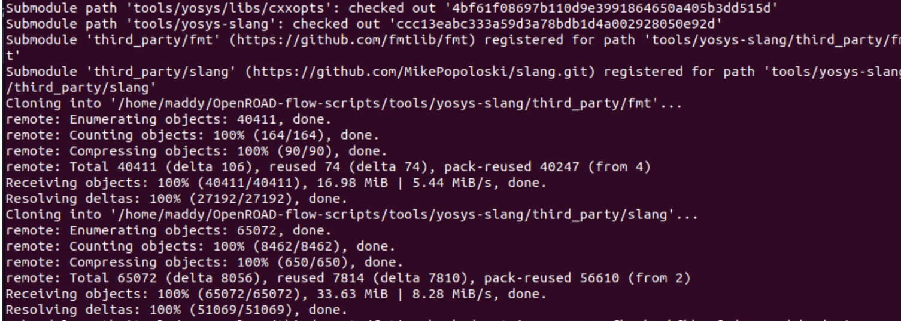
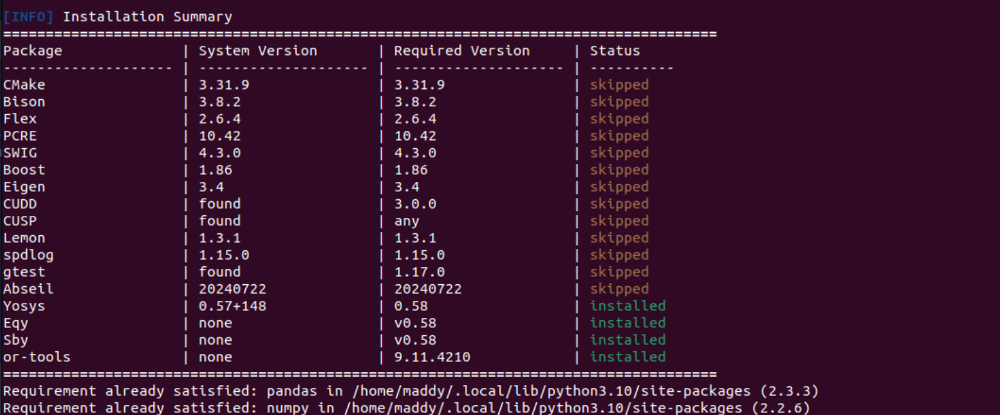

---

## 📁 Directory Structure Setup for VSDBabySoC

```bash
# Create design directories
mkdir -p flow/designs/sky130hd/vsdbabysoc
mkdir -p flow/designs/src/vsdbabysoc

# Copy design files (example structure)
# flow/designs/sky130hd/vsdbabysoc/ should contain:
#   - gds/ (avsddac.gds, avsdpll.gds)
#   - lef/ (avsddac.lef, avsdpll.lef)  
#   - lib/ (avsddac.lib, avsdpll.lib)
#   - include/ (all .vh files)
#   - config.mk, vsdbabysoc_synthesis.sdc, macro.cfg, pin_order.cfg

# flow/designs/src/vsdbabysoc/ should contain:
#   - vsdbabysoc.v, rvmyth.v, clk_gate.v
```

---

## ⚙️ Complete `config.mk` Configuration

```makefile
# Design Configuration
export DESIGN_NICKNAME = vsdbabysoc
export DESIGN_NAME = vsdbabysoc
export PLATFORM    = sky130hd

# RTL Source Files
export VERILOG_FILES = $(DESIGN_HOME)/src/$(DESIGN_NICKNAME)/vsdbabysoc.v \
                       $(DESIGN_HOME)/src/$(DESIGN_NICKNAME)/rvmyth.v \
                       $(DESIGN_HOME)/src/$(DESIGN_NICKNAME)/clk_gate.v

export SDC_FILE      = $(DESIGN_HOME)/$(PLATFORM)/$(DESIGN_NICKNAME)/vsdbabysoc_synthesis.sdc

# Design Directory Paths
export vsdbabysoc_DIR = $(DESIGN_HOME)/$(PLATFORM)/$(DESIGN_NICKNAME)
export VERILOG_INCLUDE_DIRS = $(wildcard $(vsdbabysoc_DIR)/include/)

# Macro Integration (Analog IPs)
export ADDITIONAL_GDS  = $(wildcard $(vsdbabysoc_DIR)/gds/*.gds.gz)
export ADDITIONAL_LEFS  = $(wildcard $(vsdbabysoc_DIR)/lef/*.lef)
export ADDITIONAL_LIBS = $(wildcard $(vsdbabysoc_DIR)/lib/*.lib)

# Clock Configuration
export CLOCK_PORT = CLK
export CLOCK_NET = $(CLOCK_PORT)

# Floorplanning Configuration
export FP_PIN_ORDER_CFG = $(wildcard $(DESIGN_DIR)/pin_order.cfg)
export DIE_AREA   = 0 0 1600 1600
export CORE_AREA  = 20 20 1590 1590

# Placement Configuration
export MACRO_PLACEMENT_CFG = $(wildcard $(DESIGN_DIR)/macro.cfg)
export PLACE_PINS_ARGS = -exclude left:0-600 -exclude left:1000-1600: -exclude right:* -exclude top:* -exclude bottom:*

# Optimization Settings
export TNS_END_PERCENT = 100
export REMOVE_ABC_BUFFERS = 1

# Magic Tool Configuration
export MAGIC_ZEROIZE_ORIGIN = 0
export MAGIC_EXT_USE_GDS = 1

# CTS Tuning
export CTS_BUF_DISTANCE = 600
export SKIP_GATE_CLONING = 1
```

---

## 🏃‍♂️ Complete RTL-to-GDS Flow Execution

| Stage | Command | Output |
|-------|---------|--------|
| **1. Synthesis** | `make DESIGN_CONFIG=./designs/sky130hd/vsdbabysoc/config.mk synth` | Gate-level netlist, timing reports |
| **2. Floorplan** | `make DESIGN_CONFIG=./designs/sky130hd/vsdbabysoc/config.mk floorplan` | Die/core areas, macro placement |
| **3. Placement** | `make DESIGN_CONFIG=./designs/sky130hd/vsdbabysoc/config.mk place` | Cell placement, congestion analysis |
| **4. CTS** | `make DESIGN_CONFIG=./designs/sky130hd/vsdbabysoc/config.mk cts` | Balanced clock tree |
| **5. Routing** | `make DESIGN_CONFIG=./designs/sky130hd/vsdbabysoc/config.mk route` | Final routed design |
| **GUI View** | `make DESIGN_CONFIG=./designs/sky130hd/vsdbabysoc/config.mk gui_final` | Interactive layout visualization |

---

## 📊 Flow Execution & Results

### 🟪 1. Environment Setup & Verification

**Commands:**
```bash
cd OpenROAD-flow-scripts
source env.sh
cd flow
make
```

**Verification:**
- ✅ Yosys installed and working
- ✅ OpenROAD binaries compiled successfully  
- ✅ All dependencies resolved
- ✅ Default flow execution successful

---

### 🟪 2. Building OpenROAD

**Command:**
```bash
./build_openroad.sh --local
```

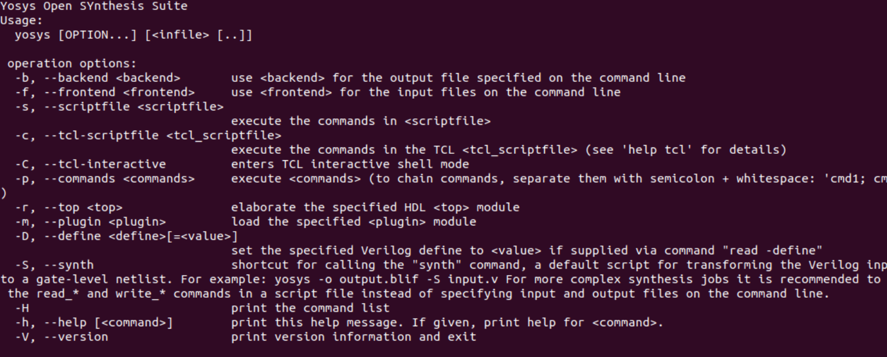

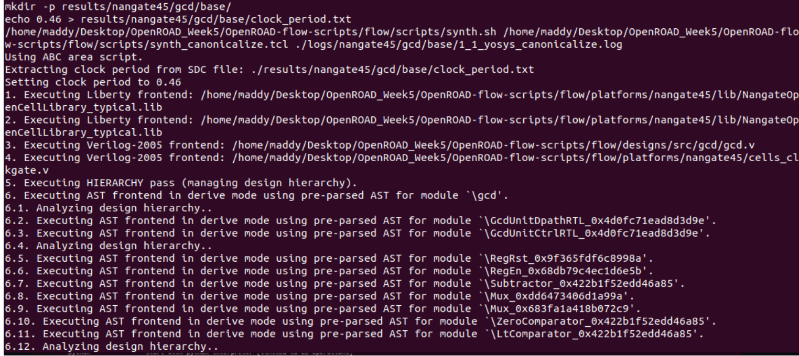
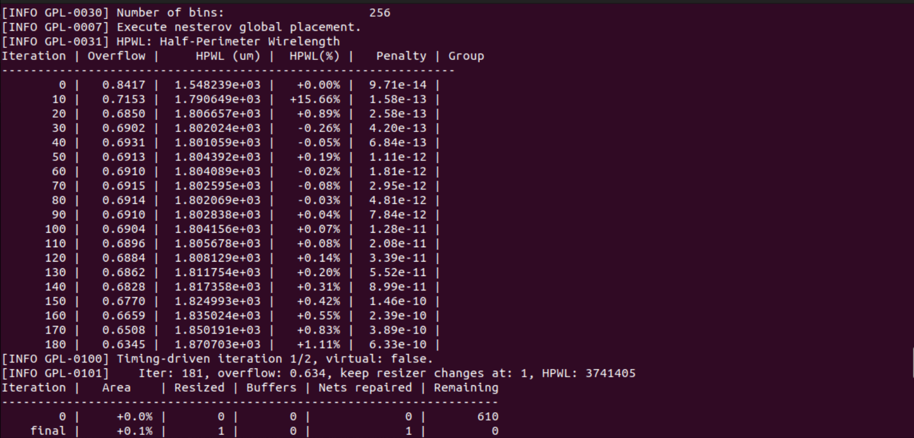
**Output:**
- ✅ OpenROAD compiled from source
- ✅ All tools integrated into flow
- ✅ Local build successful


---

### 🟪 3. Tool Verification

**Commands:**
```bash
source ./env.sh
yosys -help
openroad -help
```

**Verification:**
- ✅ Yosys help accessible
- ✅ OpenROAD help accessible
- ✅ Environment properly set up

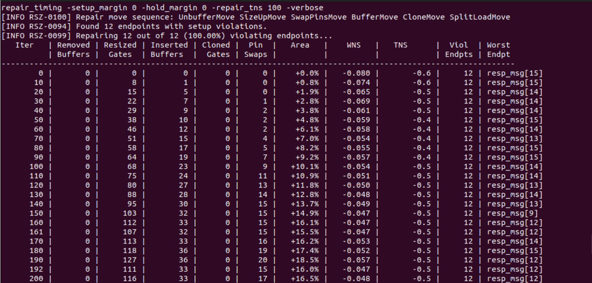


---

### 🟪 4. Flow Testing

**Command:**
```bash
make
```
**Results:**
- ✅ Default design synthesis successful
- ✅ Floorplanning completed
- ✅ Placement optimized
- ✅ Full flow execution verified


---

### 🟪 5. GUI Launch

**Command:**
```bash
make gui_final
```

**Results:**
- ✅ OpenROAD GUI launched successfully
- ✅ All tools properly mapped
- ✅ Layout visualization working

---

### 🟪 6. Directory Structure Overview

**ORFS Environment:**
```
OpenROAD-flow-scripts/
├── docker/           # Docker build support
├── docs/             # Documentation
├── flow/             # Complete RTL2GDS automation
├── tools/            # All required PD tools  
├── etc/              # Installers, dependency scripts
└── setup_env.sh      # Environment setup
```


**Flow Directory:**
```
flow/
├── designs/          # All example designs
├── platform/         # Tech files (lef/lib/gds)
├── scripts/          # OR scripts for each stage
├── tutorials/        # Training references
└── util/             # Helper scripts
```
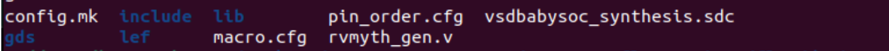
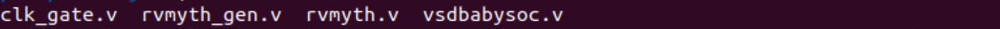
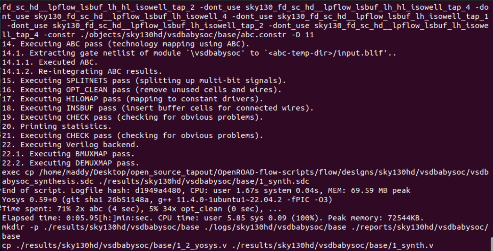


---

### 🟪 7. VSDBabySoC Integration

**Design Files Added:**
- ✅ RTL: `vsdbabysoc.v`, `rvmyth.v`, `clk_gate.v`
- ✅ Analog Macros: `avsddac`, `avsdpll` (LEF/GDS/LIB)
- ✅ Configuration: `config.mk`, `macro.cfg`, `pin_order.cfg`
- ✅ Constraints: `vsdbabysoc_synthesis.sdc`


---

### 🟪 8. Complete Flow Execution

#### **Step 1: Synthesis**
**Command:**
```bash
make DESIGN_CONFIG=./designs/sky130hd/vsdbabysoc/config.mk synth
```

**Outputs Generated:**
- ✅ Gate-level netlist (`1_synth.v`)
- ✅ Synthesis log and reports
- ✅ Timing estimation
- ✅ Cell usage statistics
- 

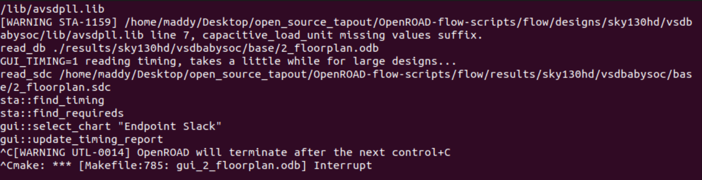
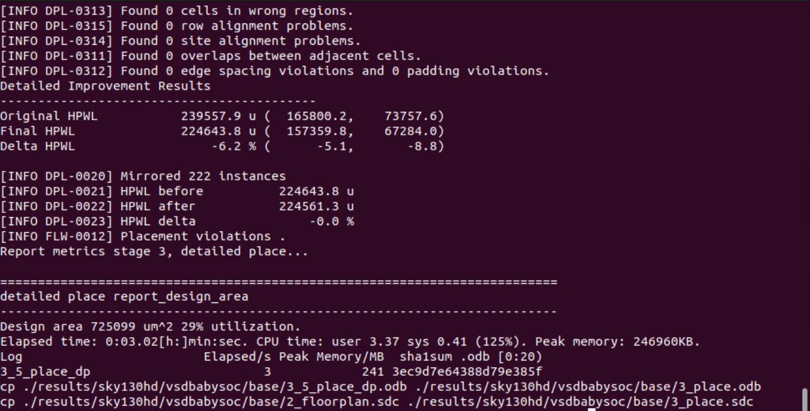

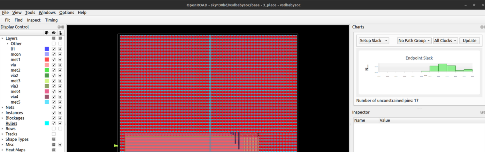
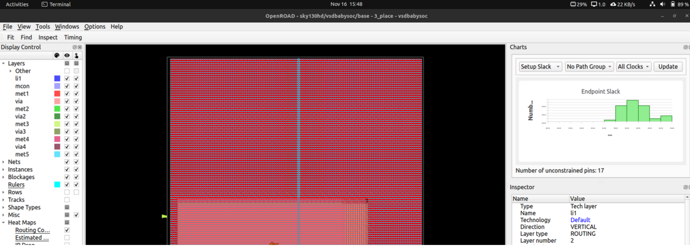

---

#### **Step 2: Floorplanning**
**Command:**
```bash
make DESIGN_CONFIG=./designs/sky130hd/vsdbabysoc/config.mk floorplan
```

**GUI Visualization:**
```bash
make DESIGN_CONFIG=./designs/sky130hd/vsdbabysoc/config.mk gui_floorplan
```

**Achievements:**
- ✅ Die and core area definition
- ✅ IO pin ordering and placement
- ✅ Macro placement configuration
- ✅ Power grid generation


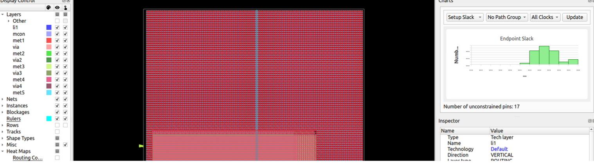

---

#### **Step 3: Placement**
**Command:**
```bash
make DESIGN_CONFIG=./designs/sky130hd/vsdbabysoc/config.mk place
```

**GUI Visualization:**
```bash
make DESIGN_CONFIG=./designs/sky130hd/vsdbabysoc/config.mk gui_place
```

**Analysis Views:**
- 📌 Routing Congestion Heatmap
- 📌 Estimated Congestion (RUDY)
- 📌 IR Drop Analysis
- 📌 Pin Density Map
- 📌 Placement Density
- 📌 Power Density Analysis


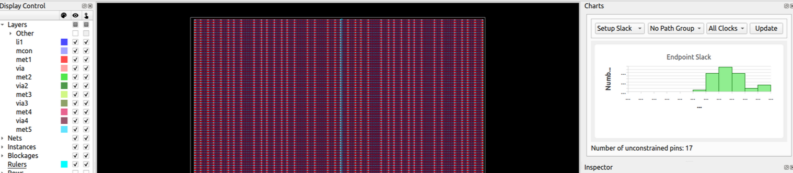


---

#### **Step 4: Clock Tree Synthesis (CTS)**
**Command:**
```bash
make DESIGN_CONFIG=./designs/sky130hd/vsdbabysoc/config.mk cts
```

**GUI Visualization:**
```bash
make DESIGN_CONFIG=./designs/sky130hd/vsdbabysoc/config.mk gui_cts
```

**Deliverables:**
- ✅ Balanced clock tree distribution
- ✅ Buffer insertion for signal integrity
- ✅ Skew optimization across clock domains
- ✅ CTS timing reports and analysis
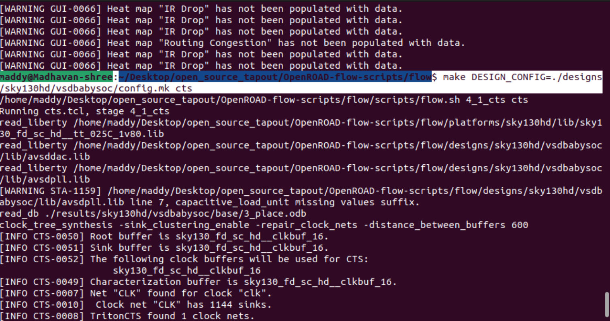


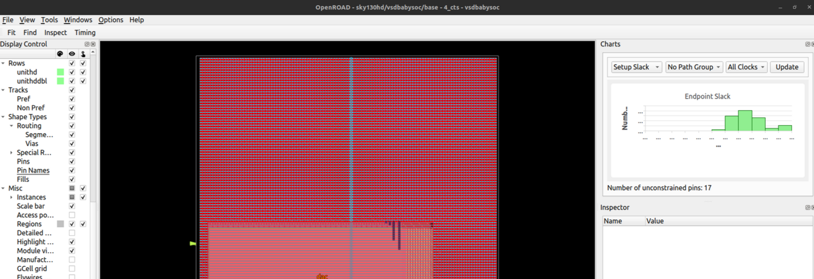


---

#### **Step 5: Routing**
**Command:**
```bash
make DESIGN_CONFIG=./designs/sky130hd/vsdbabysoc/config.mk route
```

**Results:**
- ✅ Global routing completion
- ✅ Detailed routing implementation
- ✅ DRC-clean wiring connections
- ✅ Final routed DEF output

---

## 🎯 Week 7 Achievements Summary

### ✅ **Completed Tasks**
1. **Environment Setup**
   - Installed OpenROAD-Flow-Scripts with all dependencies
   - Built OpenROAD locally and verified installation
   - Tested complete flow with default design

2. **Design Integration**  
   - Created VSDBabySoC directory structure in ORFS
   - Integrated RTL files and analog macros (avsddac, avsdpll)
   - Configured design constraints and timing files

3. **Configuration Development**
   - Wrote comprehensive `config.mk` for automated flow
   - Defined floorplan dimensions and pin ordering
   - Configured macro placement and CTS settings

4. **Full RTL-to-GDS Execution**
   - Successfully ran synthesis → floorplan → placement → CTS → routing
   - Generated all intermediate results and final outputs
   - Verified each stage with GUI visualization and reports

### 📊 **Key Outputs Generated**
- Gate-level netlist from synthesis
- Floorplan with proper die/core dimensions
- Optimized cell placement with congestion analysis
- Balanced clock tree with CTS
- DRC-clean routed design
- Complete set of logs and reports for each stage

---

## 📚 Key Learnings — Week 7

### 🛠️ **Tools & Frameworks Mastered**
- **OpenROAD-Flow-Scripts** - Complete automation framework for physical design
- **Yosys** - RTL synthesis and technology mapping
- **OpenROAD** - Floorplanning, placement, CTS, and routing
- **TritonTools** - Backend implementation tools
- **Sky130 PDK** - Process design kit for 130nm technology

### 🔧 **Technical Skills Developed**
- End-to-end RTL-to-GDS flow automation
- Design configuration and constraint management
- Macro integration and placement planning
- Clock tree synthesis and optimization
- Physical verification and DRC cleanup
- Performance analysis and reporting

### 💡 **Workflow Insights**
- Automated flows significantly reduce manual effort and errors
- Proper configuration is crucial for successful tapeout
- GUI visualization helps in debugging and optimization
- Comprehensive logging enables thorough analysis
- Open-source tools provide professional-grade results

---

## 🎉 Conclusion

**Week 7** represents a major milestone in the RISC-V SoC Tapeout Program — the successful automation of the complete physical design flow for VSDBabySoC using open-source ASIC tools. 

From RTL synthesis to final GDSII generation, every stage was executed systematically with OpenROAD-Flow-Scripts, demonstrating that professional-grade chip design is accessible through open-source ecosystems. The integration of analog macros, proper constraint management, and comprehensive verification ensures a tapeout-ready design.

This achievement validates the viability of open-source EDA tools for complex SoC development and sets the stage for final tapeout preparations.

---
