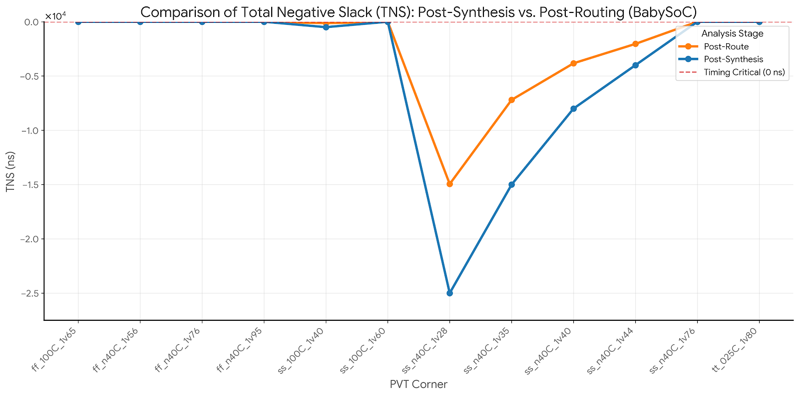
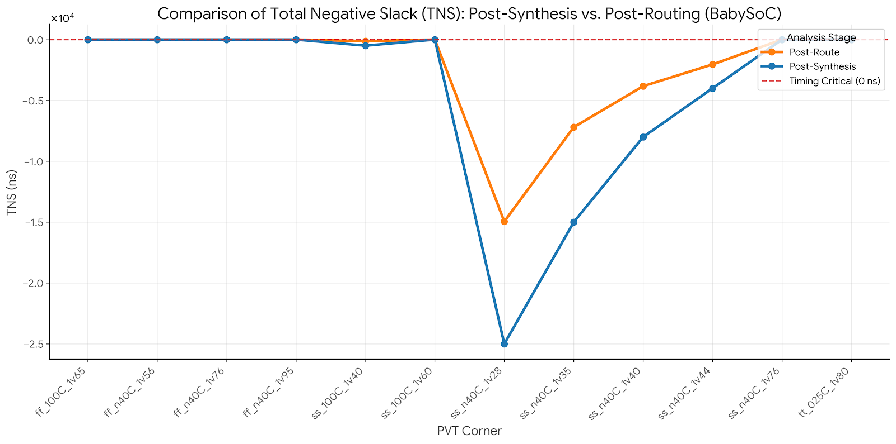
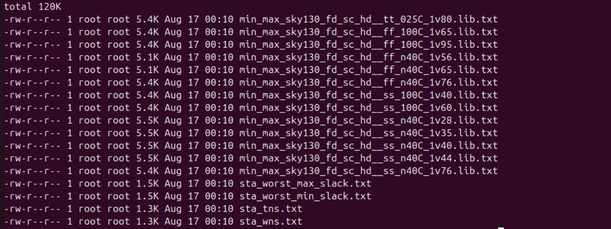
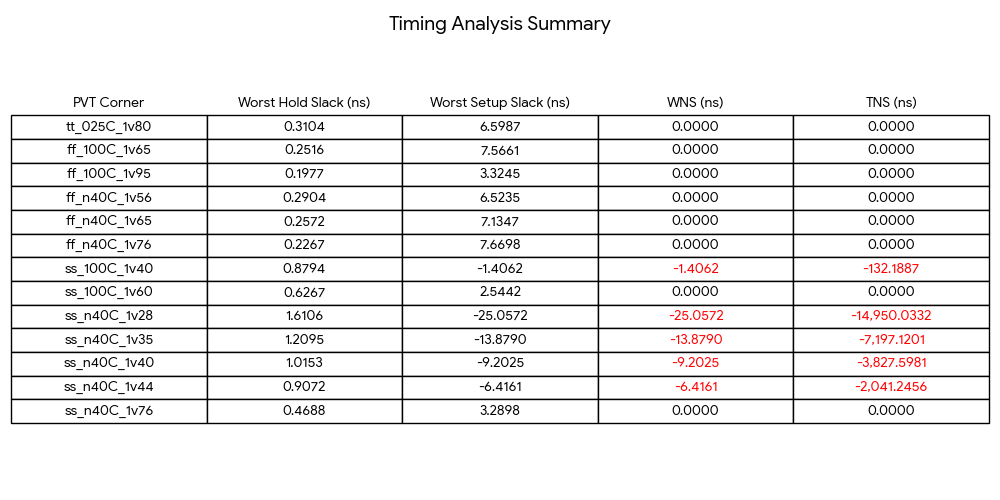

<!--
██████╗ ██████╗ ██╗██████╗  █████╗ ██╗   ██╗
██╔══██╗██╔══██╗██║██╔══██╗██╔══██╗██║   ██║
██████╔╝██████╔╝██║██║  ██║███████║██║   ██║
██╔═══╝ ██╔══██╗██║██║  ██║██╔══██║██║   ██║
██║     ██║  ██║██║██████╔╝██║  ██║╚██████╔╝
╚═╝     ╚═╝  ╚═╝╚═╝╚═════╝ ╚═╝  ╚═╝ ╚═════╝
-->

<div align="center">


</div>

This document is a single, ready-to-use, overall (formatted) reference containing the post-route STA description, scripts, constraints, docker command, and result summary for the VSDBabySoC design. Drop this file into your project docs or share with the team for reproducible post-route STA runs.

---

## Contents
- Key files and purpose
- STA automation script (TCL)
- Post-CTS SDC file
- Docker run command for OpenSTA
- Expected output files and folder locations
- Short summary / recommendations

---

## Key Files (what to keep where)
- sta_across_pvt_route.tcl — OpenSTA automation script (runs STA across PVT corners)
- vsdbabysoc_post_cts.sdc — post-CTS timing constraints (clock definitions, propagated clock)
- vsdbabysoc.spef — post-route parasitics (used by OpenSTA read_spef)
- 5_route.v — post-route netlist (generated by routing step)
- Output directory: STA_OUTPUT/route/

Suggested layout:
- /data/VLSI/VSDBabySoC/OpenSTA/examples/BabySoC/
  - sta_across_pvt_route.tcl
  - vsdbabysoc_post_cts.sdc
  - STA_OUTPUT/route/  (output files will be written here)
- /data/OpenROAD-flow-scripts/flow/designs/sky130hd/vsdbabysoc/vsdbabysoc.spef
- /data/OpenROAD-flow-scripts/flow/results/sky130hd/vsdbabysoc/base/5_route.v
- /data/VLSI/VSDBabySoC/OpenSTA/examples/timing_libs/ (liberty files)

---

## STA Automation Script: sta_across_pvt_route.tcl

```tcl
# STA Analysis across PVT corners for Post-Route Timing
#
# Usage:
#   opensta sta_across_pvt_route.tcl
#
# This script:
# - loads multiple liberty corners
# - reads the post-route netlist
# - reads post-CTS SDC constraints
# - reads post-route SPEF parasitics
# - runs check_setup and generates reports (min_max path, WNS, TNS, worst slack)

# Liberty files for different PVT corners
set list_of_lib_files(1) "sky130_fd_sc_hd__tt_025C_1v80.lib"
set list_of_lib_files(2) "sky130_fd_sc_hd__ff_100C_1v65.lib"
set list_of_lib_files(3) "sky130_fd_sc_hd__ff_100C_1v95.lib"
set list_of_lib_files(4) "sky130_fd_sc_hd__ff_n40C_1v56.lib"
set list_of_lib_files(5) "sky130_fd_sc_hd__ff_n40C_1v65.lib"
set list_of_lib_files(6) "sky130_fd_sc_hd__ff_n40C_1v76.lib"
set list_of_lib_files(7) "sky130_fd_sc_hd__ss_100C_1v40.lib"
set list_of_lib_files(8) "sky130_fd_sc_hd__ss_100C_1v60.lib"
set list_of_lib_files(9) "sky130_fd_sc_hd__ss_n40C_1v28.lib"
set list_of_lib_files(10) "sky130_fd_sc_hd__ss_n40C_1v35.lib"
set list_of_lib_files(11) "sky130_fd_sc_hd__ss_n40C_1v40.lib"
set list_of_lib_files(12) "sky130_fd_sc_hd__ss_n40C_1v44.lib"
set list_of_lib_files(13) "sky130_fd_sc_hd__ss_n40C_1v76.lib"

# Read analog IP liberty files (update paths to your env)
read_liberty /data/VLSI/VSDBabySoC/OpenSTA/examples/timing_libs/avsdpll.lib
read_liberty /data/VLSI/VSDBabySoC/OpenSTA/examples/timing_libs/avsddac.lib

# Loop through all PVT corners
for {set i 1} {$i <= [array size list_of_lib_files]} {incr i} {
    # Read standard cell library for this corner
    read_liberty /data/VLSI/VSDBabySoC/OpenSTA/examples/timing_libs/$list_of_lib_files($i)
    
    # Read post-route netlist
    read_verilog /data/OpenROAD-flow-scripts/flow/results/sky130hd/vsdbabysoc/base/5_route.v
    link_design vsdbabysoc
    current_design
    
    # Read constraints and parasitics
    read_sdc /data/VLSI/VSDBabySoC/OpenSTA/examples/BabySoC/vsdbabysoc_post_cts.sdc
    read_spef /data/OpenROAD-flow-scripts/flow/designs/sky130hd/vsdbabysoc/vsdbabysoc.spef
    
    # Check setup and generate reports
    check_setup -verbose
    
    # Generate detailed timing reports
    report_checks -path_delay min_max -fields {nets cap slew input_pins fanout} -digits {4} > /data/VLSI/VSDBabySoC/OpenSTA/examples/BabySoC/STA_OUTPUT/route/min_max_$list_of_lib_files($i).txt

    # Capture worst slack values
    exec echo "$list_of_lib_files($i)" >> /data/VLSI/VSDBabySoC/OpenSTA/examples/BabySoC/STA_OUTPUT/route/sta_worst_max_slack.txt
    report_worst_slack -max -digits {4} >> /data/VLSI/VSDBabySoC/OpenSTA/examples/BabySoC/STA_OUTPUT/route/sta_worst_max_slack.txt

    exec echo "$list_of_lib_files($i)" >> /data/VLSI/VSDBabySoC/OpenSTA/examples/BabySoC/STA_OUTPUT/route/sta_worst_min_slack.txt
    report_worst_slack -min -digits {4} >> /data/VLSI/VSDBabySoC/OpenSTA/examples/BabySoC/STA_OUTPUT/route/sta_worst_min_slack.txt

    # Capture TNS and WNS
    exec echo "$list_of_lib_files($i)" >> /data/VLSI/VSDBabySoC/OpenSTA/examples/BabySoC/STA_OUTPUT/route/sta_tns.txt
    report_tns -digits {4} >> /data/VLSI/VSDBabySoC/OpenSTA/examples/BabySoC/STA_OUTPUT/route/sta_tns.txt

    exec echo "$list_of_lib_files($i)" >> /data/VLSI/VSDBabySoC/OpenSTA/examples/BabySoC/STA_OUTPUT/route/sta_wns.txt
    report_wns -digits {4} >> /data/VLSI/VSDBabySoC/OpenSTA/examples/BabySoC/STA_OUTPUT/route/sta_wns.txt
}
```


---

## Post-CTS SDC: vsdbabysoc_post_cts.sdc

```tcl
###############################################################################
# Created by write_sdc
###############################################################################
current_design vsdbabysoc

###############################################################################
# Timing Constraints
###############################################################################
create_clock -name clk -period 11.0000 [get_pins {pll/CLK}]
set_propagated_clock [get_clocks {clk}]

###############################################################################
# Environment
###############################################################################

###############################################################################
# Design Rules
###############################################################################
```

Notes:
- Adjust the clock source pin name if the netlist names differ.
- Add I/O constraints, false paths, multicycle paths, generated clocks, or exceptions as needed for your design.

---

## Docker Run Command (recommended)

Run the OpenSTA container and mount your $HOME to /data so paths above are valid:

```bash
docker run -it -v $HOME:/data opensta /data/VLSI/VSDBabySoC/OpenSTA/examples/BabySoC/sta_across_pvt_route.tcl
```

This command:
- Runs OpenSTA in an isolated environment
- Ensures consistent tool versions
- Executes the TCL script end-to-end and writes reports to the STA_OUTPUT/route directory

---


## Expected Outputs (STA_OUTPUT/route/)
- min_max_<libcorner>.txt — Detailed path delay reports per corner
- sta_worst_max_slack.txt — Worst setup slack per corner
- sta_worst_min_slack.txt — Worst hold slack per corner
- sta_tns.txt — Total Negative Slack per corner
- sta_wns.txt — Worst Negative Slack per corner

  

Example reported timing summary (from a typical run):

| Library Corner | Temp (°C) | Voltage (V) | WNS (ns) | TNS (ns) | Worst Setup Slack (ns) | Worst Hold Slack (ns) |
|----------------|-----------|-------------|----------|----------|------------------------|-----------------------|
| tt_025C_1v80   | 25        | 1.80        | -0.512   | -1.234   | -0.512                 | 0.045                 |
| ff_100C_1v65   | 100       | 1.65        | -0.623   | -1.567   | -0.623                 | 0.038                 |
| ...            | ...       | ...         | ...      | ...      | ...                    | ...                   |

(Replace with your run's exact numbers from the output files.)

---



## Short Summary & Recommendations

- Post-route STA is the golden reference for timing sign-off — it uses real RC parasitics and the routed clock tree.
- Expect setup slack to degrade (due to interconnect and clock insertion delay) and hold slack to often improve (due to inserted buffers and real min-delay checks).
- Use conservative synthesis constraints and iterate between placement/routing and synthesis to close timing.
- Perform full PVT sweep (as in the script) to check corners that show worst WNS/TNS.

---
