<!--
██████╗ ██████╗ ██╗██████╗  █████╗ ██╗   ██╗
██╔══██╗██╔══██╗██║██╔══██╗██╔══██╗██║   ██║
██████╔╝██████╔╝██║██║  ██║███████║██║   ██║
██╔═══╝ ██╔══██╗██║██║  ██║██╔══██║██║   ██║
██║     ██║  ██║██║██████╔╝██║  ██║╚██████╔╝
╚═╝     ╚═╝  ╚═╝╚═╝╚═════╝ ╚═╝  ╚═╝ ╚═════╝
-->


<p align="center">⚡️ GATE LEVEL SIMULATION AND STATIC TIMING ANALYSIS IN BABYSOC ⚡️</p>

<p align="center">
  <b>🧩 Post-Synthesis Functional Verification</b><br>
  Using <b>Yosys</b>, <b>Icarus Verilog</b>, <b>GTKWave</b>, and <b>OpenSTA</b>
</p>

<p align="center">
  
  
  
</p>

---

## 🎯 Purpose of GLS

Gate-Level Simulation (**GLS**) verifies the functionality of a design **after synthesis**. Unlike RTL simulation, GLS runs on a **gate-level netlist**, incorporating real gate delays and mapped cells to ensure **timing accuracy** and **functional consistency**.

| 🧠 Aspect | 💡 Description |
|:----------|:---------------|
| 🕒 Timing Verification | Uses **SDF** (Standard Delay Format) to validate setup/hold timing and propagation delays |
| ✅ Functional Validation | Ensures logical correctness after synthesis and technology mapping |
| ⚙️ Tools Used | **Yosys**, **Icarus Verilog**, **GTKWave** |
| 🧩 Why Important for BabySoC | Confirms correct operation of integrated modules like **RISC-V processor**, **PLL**, and **DAC** |

---

## 🏗️ Yosys Synthesis & Netlist Generation Flow

<details open>
<summary><b>Step-by-Step Yosys Flow (with Images)</b></summary>

### ⚙️ Step 1: Load Standard Cell Libraries

```bash
read_liberty -lib ./src/lib/avsdpll.lib        # PLL cell library
read_liberty -lib ./src/lib/avsddac.lib        # DAC cell library
read_liberty -lib ./src/lib/sky130_fd_sc_hd__tt_025C_1v80.lib  # Sky130 standard cell library
```

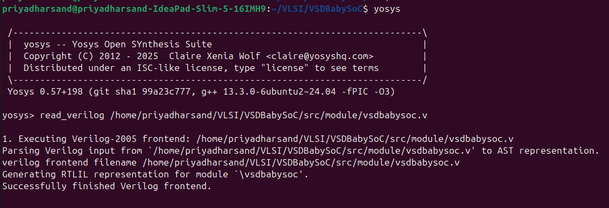
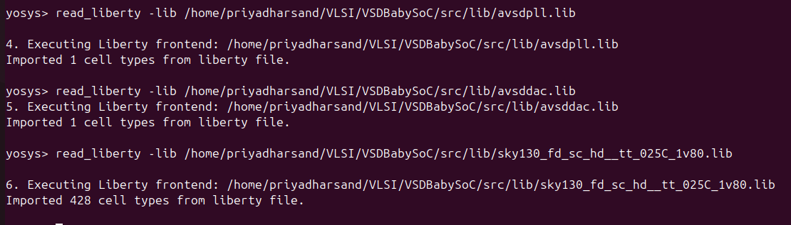

---

### 🧠 Step 2: Read Verilog Design Files

```bash
read_verilog ./src/module/vsdbabysoc.v         # Top-level SoC module
read_verilog -I ./src/include ./src/module/rvmyth.v      # CPU core (RISC-V Myth)
read_verilog -I ./src/include ./src/module/clk_gate.v    # Clock gating module
```


  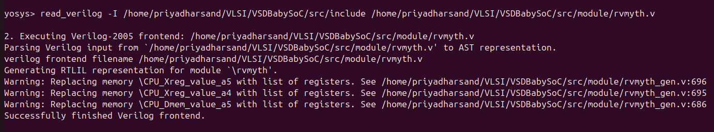
  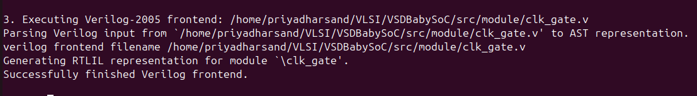


---

### 🧮 Step 3: Synthesis

```bash
synth -top vsdbabysoc
dfflibmap -liberty ./src/lib/sky130_fd_sc_hd__tt_025C_1v80.lib
opt
```

  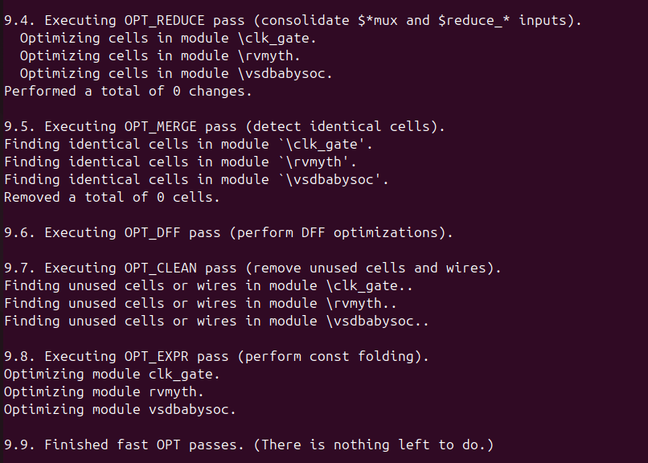

---

### ⚡ Step 4: Technology Mapping using ABC

```bash
abc -liberty ./src/lib/sky130_fd_sc_hd__tt_025C_1v80.lib
```

<p align="center">
  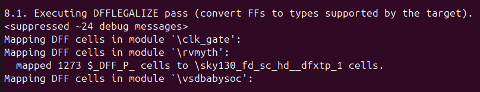
</p>

> 🧩 Performs logic optimization and maps design to Sky130 standard cells.

---

### 🧹 Step 5: Post-Processing

```bash
flatten
setundef -zero
clean -purge
rename -enumerate
```

  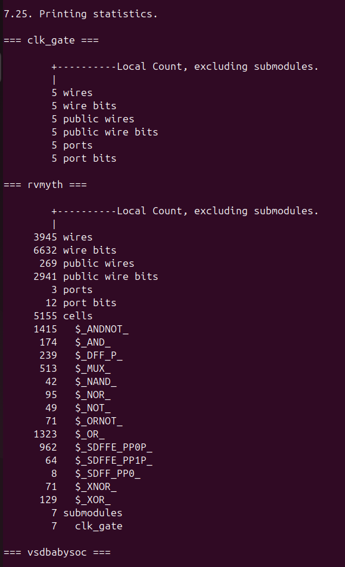

---

### 🧾 Step 6: Reporting and Writing Output

stat
write_verilog -noattr ./output/post_synth_sim/vsdbabysoc.synth.v


✅ **Result:** `vsdbabysoc.synth.v` generated successfully — ready for Gate-Level Simulation.

### 📋 Synthesis Stages

| 🔢 Stage | 📝 Description |
|:---------|:---------------|
| 🧱 Flatten | Converts hierarchical design into single-level netlist |
| 🧹 Clean | Removes unused/dangling nets and logic |
| 📊 Stat | Reports cell count, area, and hierarchy |
| 💾 Write Netlist | Saves final synthesized Verilog for simulation |

### 📸 Snapshots

* 🧩 **Design Hierarchy:**  
  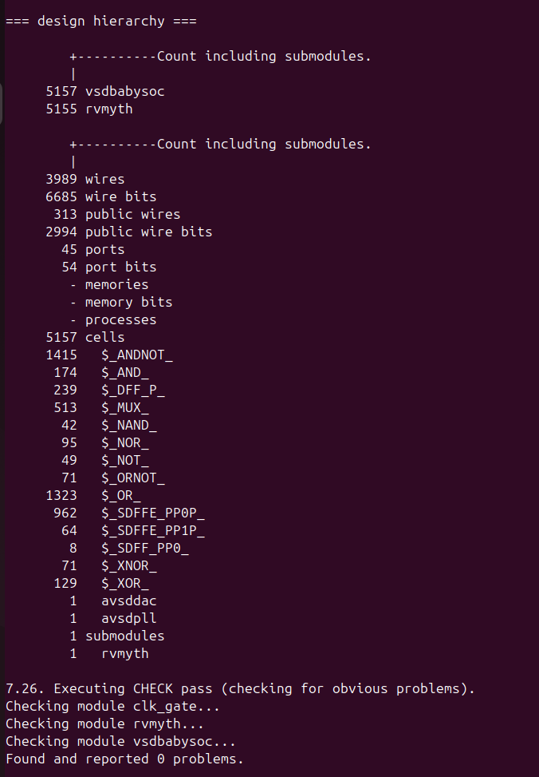
* ⚙️ **After ABC Mapping:**  
  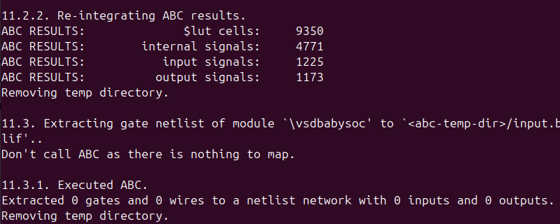
* 📊 **Module Stats:**  
  
---

## 🧪 Post-Synthesis Simulation Flow

| ⚙️ Step | 🧾 Command | 💬 Description |
|:--------|:-----------|:---------------|
| **1️⃣ Compile** | `iverilog -o ./output/post_synth_sim/post_synth_sim.out -DPOST_SYNTH_SIM -DFUNCTIONAL -DUNIT_DELAY=#1 -I ./output/src/include -I ./output/src/module ./output/src/module/testbench.v` | Compile testbench with synthesized gate-level design |
| **2️⃣ Navigate** | `cd ./output/post_synth_sim/` | Go to simulation directory |
| **3️⃣ Run Simulation** | `./post_synth_sim.out` | Execute the compiled simulation binary |
| **4️⃣ View Waveforms** | `gtkwave post_synth_sim.vcd` | Open simulation waveforms in GTKWave |

 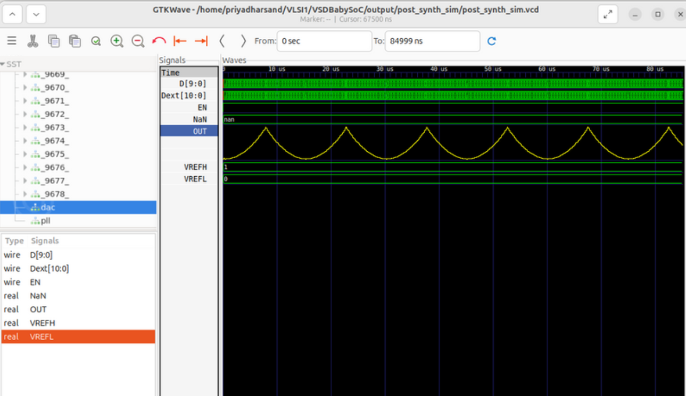


---

## 📊 Pre vs Post Synthesis Comparison

| Simulation Type | Level | Purpose | Output |
|:----------------|:------|:--------|:-------|
| 🌿 Pre-Synthesis (RTL) | Behavioral | Functional check before synthesis | `pre_synth_sim.vcd` |
| ⚡ Post-Synthesis (GLS) | Structural | Checks real gate-level timing and logic | `post_synth_sim.vcd` |


 
 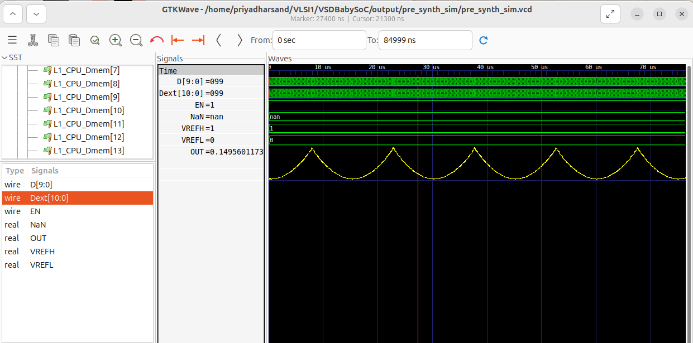

---

<p align="center">
  💡 <b>Conclusion:</b> Gate-Level Simulation ensures BabySoC’s synthesized design meets both functional and timing specifications before tape-out.<br>
  🧮 Verified Logic • 🕒 Accurate Timing • ⚙️ Real Hardware Behavior
</p>

---

# ⏱️ Static Timing Analysis with **OpenSTA**

---

## 🧩 Introduction to STA

**Static Timing Analysis (STA)** is a key tool for verifying digital design timing **without simulation vectors**. STA exhaustively checks all paths for setup and hold constraints across process, voltage, and temperature corners.

| Method | Depends on Input Data | Type | Purpose |
|:-------|:---------------------:|:----:|:--------|
| Static Timing Analysis | ❌ No  | Deterministic | Fast and exhaustive timing verification |
| Timing Simulation     | ✅ Yes | Dynamic      | Validates timing and functionality      |

---

## 🏗️ STA in the Digital Design Flow

 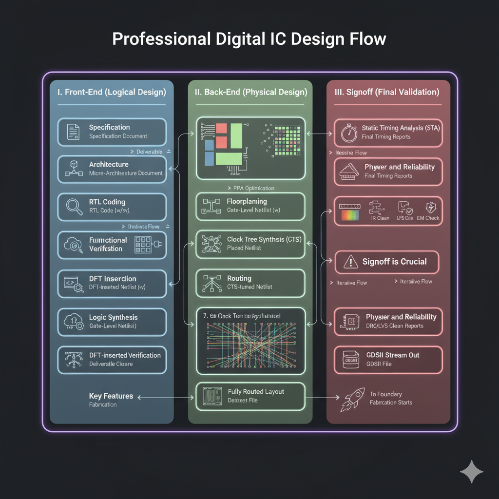

---


## 📥 Required Files

| File Type | Description |
|:----------|:------------|
| `*.v` | Gate-level Verilog netlist |
| `*.lib` | Liberty timing libraries |
| `*.sdc` | Synopsys Design Constraints |
| `*.sdf` | Annotated Delay File (optional) |
| `*.spef` | RC parasitic extraction |
| `*.vcd` / `*.saif` | Switching activity for power analysis |

---

## ⏰ Clock Modeling Features

- 🧮 Generated clocks (from base clocks)
- 🕒 Latency & source latency
- ⚖️ Uncertainty (jitter/skew)
- 🔄 Propagated vs. ideal clocks
- 🚦 Gated clock checks
- 🧭 Multi-frequency domains

---

## 🧩 Exception Paths

| Command | Description |
|:--------|:------------|
| `set_false_path` | Ignore unused/invalid functional paths |
| `set_multicycle_path` | Allow multiple cycles for specific paths |
| `set_max_delay` / `set_min_delay` | Custom path delays |

---

## 📐 Delay Calculation

- ⚡ Effective capacitance models (Dartu/Menezes/Pileggi)
- 🧰 External delay calculator API (layout, temperature-aware models)

---

## 🧾 Timing Analysis & Reporting

**OpenSTA** reporting example:

```tcl
report_checks -from [get_pins U1/Q] -to [get_pins U2/D]
```

---

## 🔗 Timing Path Types

| Path Type | Description |
|:----------|:------------|
| Input → Register    | Input captured into a register  |
| Register → Register | Data transfer between registers |
| Register → Output   | Registered output path          |
| Input → Output      | Pure combinational path         |


---

## 📉 Setup and Hold Checks

| Type | Meaning | Violation Cause |
|:-----|:--------|:----------------|
| Setup Time | Data must be stable *before* clock edge | Data arrives too late |
| Hold Time | Data must remain stable *after* clock edge | Data changes too early |

---

## 🧮 Slack Calculation

> **Setup Slack** = Data Required Time − Data Arrival Time  
> **Hold Slack** = Data Arrival Time − Data Required Time

| Slack Type | Interpretation |
|:-----------|:---------------|
| Positive Slack | Design meets timing (safe margin) |
| Zero Slack | Critical path (operating limit) |
| Negative Slack | Timing violation (failure) |

---

## 🧠 Key Concepts

| Term | Meaning |
|:-----|:--------|
| Data Arrival Time | Time for signal to travel from source to destination |
| Data Required Time | Time for clock to propagate to endpoint |
| Slack | Timing margin between expected and actual arrival times |

---

## 🧾 Common SDC Constraints

| Category | Example Commands |
|:---------|:-----------------|
| Operating Conditions | `set_operating_conditions` |
| Wire-load Models | `set_wire_load_mode`, `set_wire_load_model` |
| Environmental | `set_drive`, `set_load` |
| Design Rules | `set_max_capacitance`, `set_max_fanout` |
| Timing | `create_clock`, `set_clock_latency`, `set_input_delay` |
| Exceptions | `set_false_path`, `set_multicycle_path` |
| Power | `set_max_dynamic_power`, `set_max_leakage_power` |

---

## 🧩 Installation of OpenSTA

### 1️⃣ Clone Repo

```bash
git clone https://github.com/parallaxsw/OpenSTA.git
cd OpenSTA
```

### 2️⃣ Build Docker Image

```bash
docker build --file Dockerfile.ubuntu22.04 --tag opensta .
```

### 3️⃣ Run OpenSTA Container

```bash
docker run -it -v $HOME:/data opensta
```

---

## ⚙️ Basic Inline Timing Analysis

Inside the OpenSTA shell:

```tcl
read_liberty ./examples/nangate45_slow.lib.gz
read_verilog ./examples/example1.v
link_design top
create_clock -name clk -period 10 {clk1 clk2 clk3}
set_input_delay -clock clk 0 {in1 in2}
report_checks
report_checks -path_delay min_max
```

---

## 🧮 Yosys Synthesis Example

```bash
cd ~/VLSI/VSDBabySoC/OpenSTA/examples/
yosys
yosys> read_liberty -lib nangate45_slow.lib
yosys> read_verilog example1.v
yosys> synth -top top
yosys> show
```

---

## 🧠 TCL Script-Based Timing Analysis

**min_max_delays.tcl**
```tcl
read_liberty -max ./examples/nangate45_slow.lib.gz
read_liberty -min ./examples/nangate45_fast.lib.gz
read_verilog ./examples/example1.v
link_design top
create_clock -name clk -period 10 {clk1 clk2 clk3}
set_input_delay -clock clk 0 {in1 in2}
report_checks -path_delay min_max
```

Run with Docker:
```bash
docker run -it -v $HOME:/data opensta /data/VLSI/VSDBabySoC/OpenSTA/examples/min_max_delays.tcl
```

---

# ⚙️ VSDBabySoC — Full STA Flow with OpenSTA

## 1️⃣ Prepare Required Files

```bash
mkdir -p OpenSTA/examples/timing_libs/
ls OpenSTA/examples/timing_libs/
# avsddac.lib  avsdpll.lib  sky130_fd_sc_hd__tt_025C_1v80.lib

mkdir -p OpenSTA/examples/BabySoC/
ls OpenSTA/examples/BabySoC/
# gcd_sky130hd.sdc  vsdbabysoc_synthesis.sdc  vsdbabysoc.synth.v
```

* 🧱 Standard Cell Library: `sky130_fd_sc_hd__tt_025C_1v80.lib`
* ⚙️ IP-Specific Libraries: `avsdpll.lib`, `avsddac.lib`
* 🧠 Synthesized Netlist: `vsdbabysoc.synth.v`
* ⏱️ Timing Constraints: `vsdbabysoc_synthesis.sdc`

---

## 2️⃣ Run Min/Max Delay Timing Checks

**vsdbabysoc_min_max_delays.tcl**
```tcl
read_liberty -min ./examples/timing_libs/sky130_fd_sc_hd__tt_025C_1v80.lib
read_liberty -max ./examples/timing_libs/sky130_fd_sc_hd__tt_025C_1v80.lib

read_liberty -min ./examples/timing_libs/avsdpll.lib
read_liberty -max ./examples/timing_libs/avsdpll.lib

read_liberty -min ./examples/timing_libs/avsddac.lib
read_liberty -max ./examples/timing_libs/avsddac.lib

read_verilog ./examples/BabySoC/vsdbabysoc.synth.v
link_design vsdbabysoc

read_sdc ./examples/BabySoC/vsdbabysoc_synthesis.sdc

report_checks
```

Run in Docker:
```bash
docker run -it -v $HOME:/data opensta /data/VLSI/VSDBabySoC/OpenSTA/examples/BabySoC/vsdbabysoc_min_max_delays.tcl
```

---

## 3️⃣ Common Errors & Fix

If you see:
```shell
Error: .../avsdpll.lib line 54, syntax error
```
**Fix:**  
Liberty files **must use `/* ... */` for comments, not `//`**.

❌ Incorrect:
```liberty
//pin (GND#2) { ... }
```
✅ Correct:
```liberty
/*
pin (GND#2) {
  direction : input;
  ...
}
*/
```


---

## 4️⃣ VSDBabySoC PVT Corner Analysis

Analyze across **Process–Voltage–Temperature (PVT)** corners:

* Setup-critical (Max Path): `ss_LowTemp_LowVolt`, `ss_HighTemp_LowVolt`
* Hold-critical (Min Path): `ff_LowTemp_HighVolt`, `ff_HighTemp_HighVolt`
* More corners: see [Sky130_fd_sc_hd PVT Libraries](https://github.com/efabless/skywater-pdk-libs-sky130_fd_sc_hd/tree/master/timing)

---

## 5️⃣ Automated STA Across All PVT Corners

**sta_across_pvt.tcl**
```tcl
set list_of_lib_files {
  sky130_fd_sc_hd__tt_025C_1v80.lib
  sky130_fd_sc_hd__ff_100C_1v65.lib
  sky130_fd_sc_hd__ff_100C_1v95.lib
  sky130_fd_sc_hd__ff_n40C_1v56.lib
  sky130_fd_sc_hd__ff_n40C_1v65.lib
  sky130_fd_sc_hd__ff_n40C_1v76.lib
  sky130_fd_sc_hd__ss_100C_1v40.lib
  sky130_fd_sc_hd__ss_100C_1v60.lib
  sky130_fd_sc_hd__ss_n40C_1v28.lib
  sky130_fd_sc_hd__ss_n40C_1v35.lib
  sky130_fd_sc_hd__ss_n40C_1v40.lib
  sky130_fd_sc_hd__ss_n40C_1v44.lib
  sky130_fd_sc_hd__ss_n40C_1v76.lib
}
read_liberty ./examples/timing_libs/avsdpll.lib
read_liberty ./examples/timing_libs/avsddac.lib
foreach lib $list_of_lib_files {
  read_liberty ./examples/timing_libs/$lib
  read_verilog ./examples/BabySoC/vsdbabysoc.synth.v
  link_design vsdbabysoc
  read_sdc ./examples/BabySoC/vsdbabysoc_synthesis.sdc

  check_setup -verbose

  report_checks -path_delay min_max -fields {nets cap slew input_pins fanout} -digits {4} \
    > ./examples/BabySoC/STA_OUTPUT/min_max_$lib.txt

  exec echo "$lib" >> ./examples/BabySoC/STA_OUTPUT/sta_worst_max_slack.txt
  report_worst_slack -max -digits {4} >> ./examples/BabySoC/STA_OUTPUT/sta_worst_max_slack.txt

  exec echo "$lib" >> ./examples/BabySoC/STA_OUTPUT/sta_worst_min_slack.txt
  report_worst_slack -min -digits {4} >> ./examples/BabySoC/STA_OUTPUT/sta_worst_min_slack.txt

  exec echo "$lib" >> ./examples/BabySoC/STA_OUTPUT/sta_tns.txt
  report_tns -digits {4} >> ./examples/BabySoC/STA_OUTPUT/sta_tns.txt

  exec echo "$lib" >> ./examples/BabySoC/STA_OUTPUT/sta_wns.txt
  report_wns -digits {4} >> ./examples/BabySoC/STA_OUTPUT/sta_wns.txt
}
```

Run with Docker:
```bash
docker run -it -v $HOME:/data opensta /data/VLSI/VSDBabySoC/OpenSTA/examples/BabySoC/sta_across_pvt.tcl
```

---

## 6️⃣ Timing Summary & Visualizations

## Metric and Visualization

# Worst Hold Slack and Worst Setup Slack  
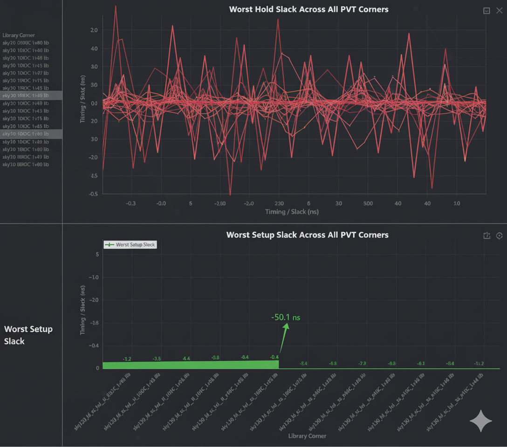

# Combined STA Metrics  
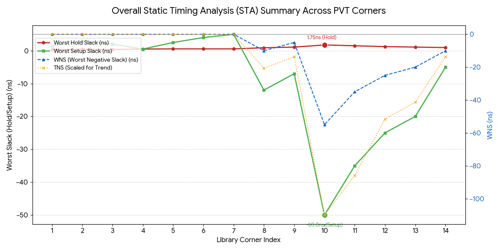

---

## ✅ Final Summary

With the above automation and scripts, your **VSDBabySoC STA flow** ensures:

* Robustness across multiple PVT corners
* Accurate setup/hold verification
* Fully reproducible, Docker-based analysis

---

<p align="center">
  <b>🎯 Successfully Completed: Gate-Level Simulation & Static Timing Analysis</b><br>
  <b>⚡ Ready for Physical Design Implementation</b>
</p>
