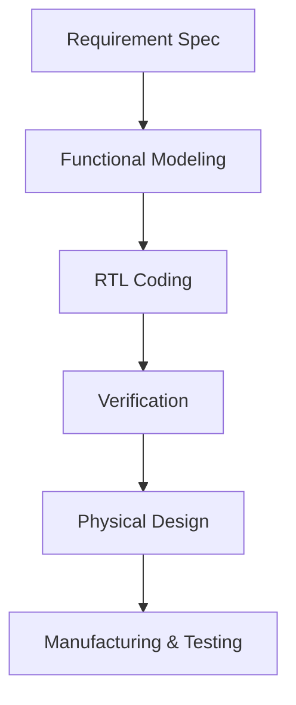
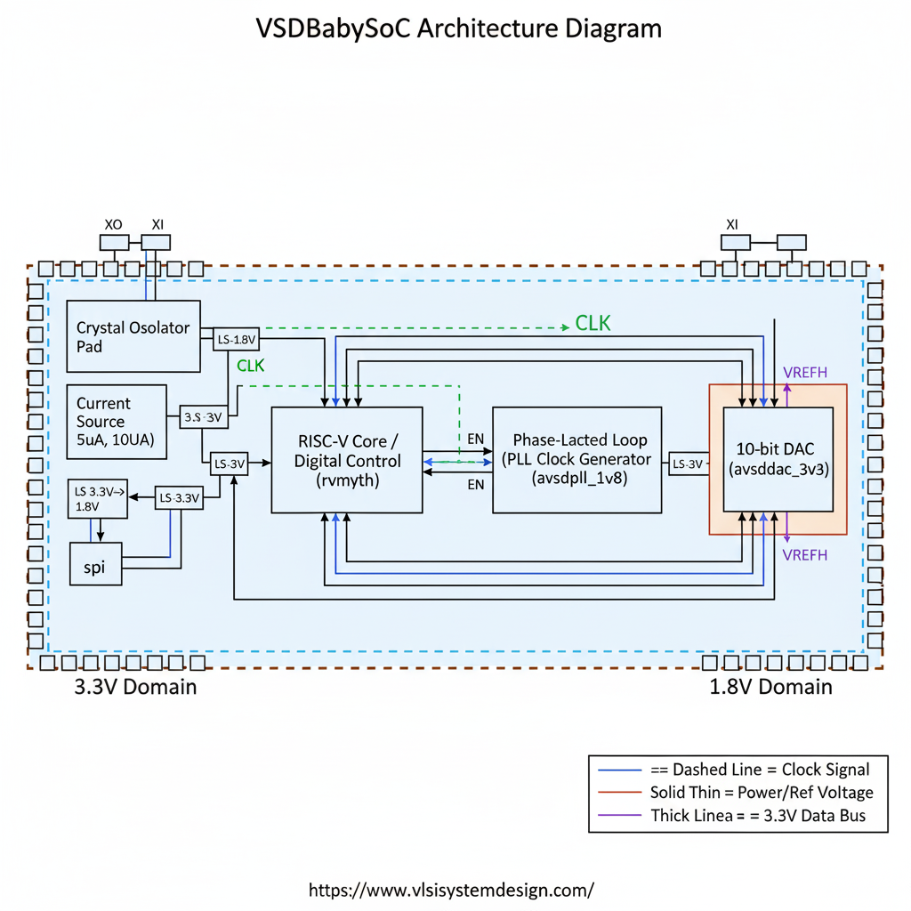
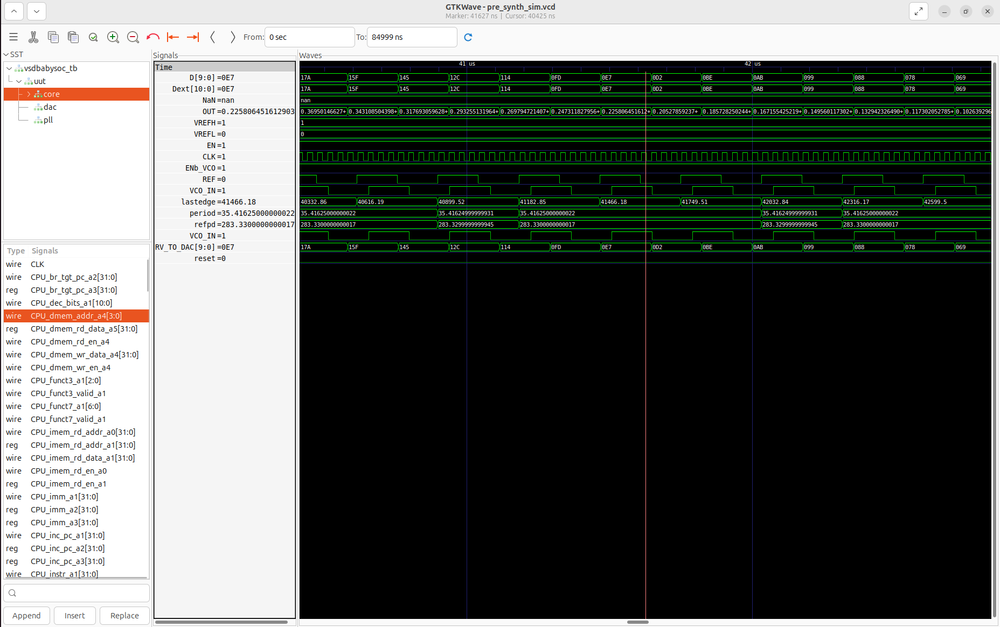

<!--
██████╗ ██████╗ ██╗██████╗  █████╗ ██╗   ██╗
██╔══██╗██╔══██╗██║██╔══██╗██╔══██╗██║   ██║
██████╔╝██████╔╝██║██║  ██║███████║██║   ██║
██╔═══╝ ██╔══██╗██║██║  ██║██╔══██║██║   ██║
██║     ██║  ██║██║██████╔╝██║  ██║╚██████╔╝
╚═╝     ╚═╝  ╚═╝╚═╝╚═════╝ ╚═╝  ╚═╝ ╚═════╝
-->
<div align="center">
  


## 🧠 What is a System-on-Chip (SoC)?

A **System-on-Chip (SoC)** is a complete electronic system—processor, memory, interfaces, and specialized blocks—integrated onto a single silicon chip.

### 🔍 SoC Advantages
- **Tiny & Portable:** Powers modern smartphones, wearables, IoT.
- **Energy-Saving:** Optimized for low power.
- **Performance Boost:** Fast communication—no external bottlenecks.
- **Cost Efficient:** Fewer components, easier manufacturing.

---

## 🗂️ SoC Building Blocks

| Component      | Function                                      |
|----------------|-----------------------------------------------|
| CPU            | Executes program instructions                 |
| Memory         | Stores data & instructions                    |
| I/O            | Connects external devices (USB, sensors)      |
| GPU            | Graphics and parallel data tasks              |
| DSP            | Audio/image signal processing                 |
| Power Mgmt     | Battery life & thermal control                |
| Connectivity   | Wireless comms (Wi-Fi, Bluetooth, LTE)        |

> **Analogy:** Imagine a SoC as a city with a mayor (CPU), libraries (memory), roads (I/O), art galleries (GPU), concert halls (DSP), power stations (Power Mgmt), and airports (Connectivity).

---

## 🏷️ SoC Types

- **Microcontroller SoC:** Simple tasks, ultra-low power (IoT, appliances)
- **Microprocessor SoC:** Runs full OS (phones, tablets)
- **ASIC SoC:** Custom-for-purpose (AI, automotive, comms)

---

## 🛠️ SoC Design Flow



---

## 🍼 VSDBabySoC – Minimal RISC-V SoC on Sky130

### 💡 Overview

VSDBabySoC is a compact, educational SoC featuring:
- **RVMYTH RISC-V CPU** (executes instructions)
- **8× PLL** (precise clock generation)
- **10-bit DAC** (digital-to-analog output)

**Purpose:** Validate open-source IPs and demonstrate digital-to-analog signal control.



---

## 🔬 What’s Inside VSDBabySoC?

- **RVMYTH Core:** Lightweight RISC-V processor, output in `r17`
- **PLL:** Generates stable clock
- **DAC:** Converts CPU data (r17) to analog voltage

---

## 📁 Project Structure

```txt
VSDBabySoC/
├── src/
│   ├── include/      # Verilog headers
│   ├── module/       # Main modules
│   │   ├── vsdbabysoc.v
│   │   ├── rvmyth.v
│   │   ├── avsdpll.v
│   │   ├── avsddac.v
│   │   └── testbench.v
├── images/           # Block diagrams, waveforms
└── output/           # Simulation results
```

---

## ⚡ Quickstart Setup

```bash
cd ~/VLSI
git clone https://github.com/manili/VSDBabySoC.git
cd VSDBabySoC/
```

---

## 🔄 TLV to Verilog Conversion

If the RVMYTH core is in TL-Verilog:

```bash
sudo apt update
sudo apt install python3-venv python3-pip
python3 -m venv sp_env
source sp_env/bin/activate
pip install pyyaml click sandpiper-saas

sandpiper-saas -i ./src/module/*.tlv -o rvmyth.v --bestsv --noline -p verilog --outdir ./src/module/
```

---

## 🧪 Simulate Pre-Synthesis

```bash
mkdir -p output/pre_synth_sim

iverilog -o output/pre_synth_sim/pre_synth_sim.out \
  -DPRE_SYNTH_SIM \
  -I src/include -I src/module \
  src/module/testbench.v

cd output/pre_synth_sim
./pre_synth_sim.out
```

View results in GTKWave:

```bash
gtkwave output/pre_synth_sim/pre_synth_sim.vcd
```

### 🚦 Key Signals

- `clk` – PLL clock output
- `reset` – System reset
- `DAC_OUT` – DAC digital output
- `RV_TO_DAC[9:0]` – Data path from CPU to DAC

---

## 🏃 Program Execution: RISC-V Example

The CPU steps through instructions that:
1. Increment counters
2. Accumulate values into `r17`
3. Oscillate output to generate a waveform
4. Halt in a loop

| #  | Instruction           | Purpose                   |
|----|-----------------------|---------------------------|
| 0  | ADDI r9, r0, 1        | r9=1 (step)               |
| 1  | ADDI r10, r0, 43      | r10=43 (limit)            |
| 2  | ADDI r11, r0, 0       | r11=0 (counter)           |
| 3  | ADDI r17, r0, 0       | r17=0 (DAC input)         |
| 4  | ADD r17, r17, r11     | accumulate                |
| 5  | ADDI r11, r11, 1      | increment counter         |
| 6  | BNE r11, r10, -4      | loop                      |
| 7  | ADD r17, r17, r11     | add to r17                |
| 8  | SUB r17, r17, r11     | subtract from r17         |
| 9  | SUB r11, r11, r9      | decrement counter         |
| 10 | BNE r11, r9, -4       | loop                      |
| 11 | SUB r17, r17, r11     | adjust                    |
| 12 | BEQ r0, r0, ...       | infinite loop             |

---

## 🕒 Timeline

| Phase         | r11 Value   | r17 Value     | Description        |
|---------------|-------------|--------------|--------------------|
| Ramp          | 0→42        | 903          | Rising waveform    |
| Peak          | 43          | 946          | Maximum output     |
| Oscillation   | 43→1        | 903±r11      | Decaying wave      |
| Final         | 1           | adjusted     | Hold steady        |

---

## 🔢 DAC Output Calculation

$$
V_{OUT} = \frac{r_{17}}{1023} \times V_{REF\_SPAN}
$$

With $V_{REF\_SPAN} = 1.0$ V:

- For $r_{17} = 903$: $V_{OUT} = 0.882$ V
- For $r_{17} = 946$: $V_{OUT} = 0.925$ V

| r17 | Voltage (V) |
|-----|-------------|
| 903 | 0.882       |
| 946 | 0.925       |

Switch GTKWave to "Analog Step" for DAC output plots.

---

## 🎯 Next Steps

Currently, the CPU instructions are hardcoded. The next goal is to create a firmware toolchain:
- Write C programs
- Compile to RISC-V binary
- Use Python to convert to hex and load to memory
- Enable true programmable SoC operation

---

## 📚 References

- [RISC-V Core (Shivani Shah)](https://github.com/shivanishah269/risc-v-core)
- [SoC Fundamentals (Hemanth Kumar)](https://github.com/hemanthkumardm/SFAL-VSD-SoC-Journey/blob/main/11.%20Fundamentals%20of%20SoC%20Design/README.md)
- [VSD SoC Journey – Spatha](https://github.com/spatha0011/spatha_vsd-hdp/tree/main/Day5)
- [VSDBabySoC (Manili)](https://github.com/manili/VSDBabySoC)

---
