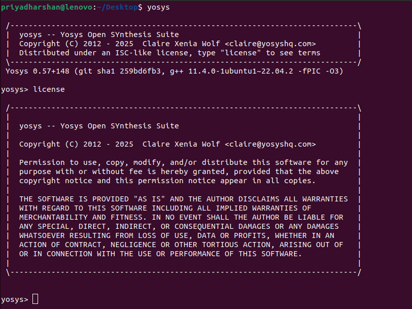
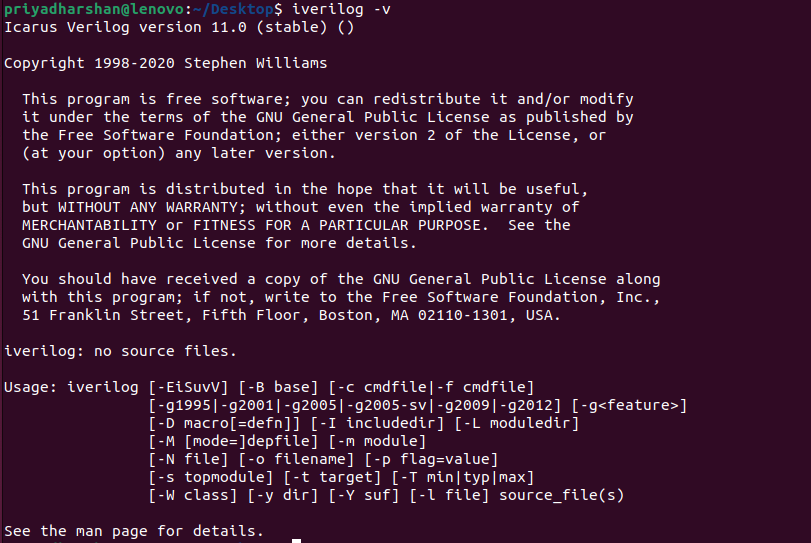
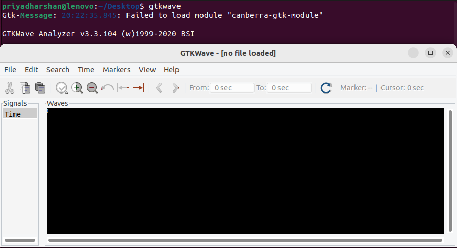
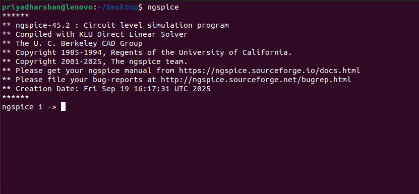
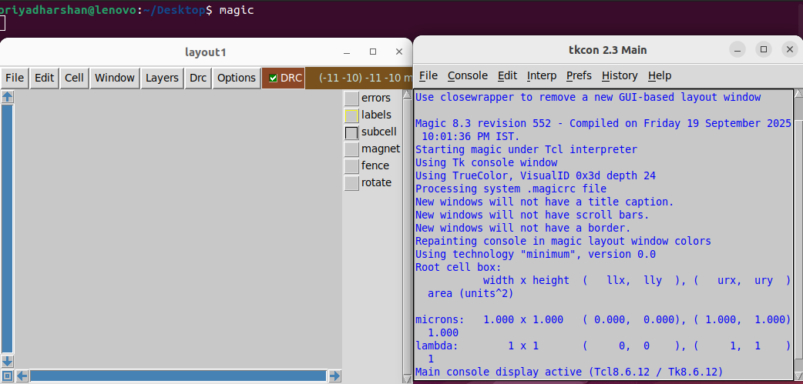

<!--
 ██████████████████████████████████████████████████████████████████████████
 █─▄▄▄▄█▄─▄█▄─█─▄█▄─▄▄─█▄─▄▄▀█▄─▄▄─█▄─▄▄─█▄─▄▄▀█▄─▄█▄─▄▄─█▄─▄█─▄▄─█▄─▄▄▀█
 █▄▄▄▄─██─███▄▀▄███─▄█▀██─▄─▄██─▄█▀██─▄█▀██─▄─▄██─███─▄█▀██─██─██─██─▄─▄█
 ▀▄▄▄▄▄▀▄▄▄▀▀▀▄▀▀▀▄▄▄▄▄▀▄▄▀▄▄▀▄▄▄▄▄▀▄▄▄▄▄▀▄▄▀▄▄▀▄▄▄▀▄▄▄▄▄▀▄▄▄▀▄▄▄▄▀▄▄▀▄▄▀
-->


<div align="center">
  
</div>

---

Welcome, fellow silicon explorer!  
This **uniquely visual guide** helps you install and verify all the vital open-source EDA tools for your RISC-V SoC tapeout journey.  
Every tool section features:

- 🚀 **Install Command**
- 🖼️ **Real Verification Screenshot (from my setup)**

---

## 1. 🎩 Yosys — _Synthesis Wizard_

**Install Command**
```bash
sudo apt-get update
git clone https://github.com/YosysHQ/yosys.git
cd yosys
sudo apt install make (If make is not installed please install it)
sudo apt-get install build-essential clang bison flex \
libreadline-dev gawk tcl-dev libffi-dev git \
graphviz xdot pkg-config python3 libboost-system-dev \
libboost-python-dev libboost-filesystem-dev zlib1g-dev
make config-gcc
make
sudo make install
```
**Verify**
```bash
yosys
```


---

## 2. ⚙️ Icarus Verilog — _Simulation Engine_

**Install Command**
```bash
sudo apt-get update
sudo apt-get install iverilog
```
**Verify**
```bash
iverilog
```


---

## 3. 🌊 GTKWave — _Waveform Explorer_

**Install Command**
```bash
sudo apt-get update
sudo apt install gtkwave
```
**Verify**
```bash
gtkwave
```


---

## 4. ⚡ Ngspice — _Analog/Mixed-Signal Sim_

**Install Command**
```bash
tar -zxvf ngspice-37.tar.gz
cd ngspice-37
mkdir release
cd release
../configure --with-x --with-readline=yes --disable-debug
make
sudo make install
```
**Verify**
```bash
ngspice
```


---

## 5. 🧙‍♂️ Magic VLSI — _Layout Magician_

**Install Command**
```bash
sudo apt-get install m4
sudo apt-get install tcsh
sudo apt-get install csh
sudo apt-get install libx11-dev
sudo apt-get install tcl-dev tk-dev
sudo apt-get install libcairo2-dev
sudo apt-get install mesa-common-dev libglu1-mesa-dev
sudo apt-get install libncurses-dev
git clone https://github.com/RTimothyEdwards/magic
cd magic
./configure
make
make install
```
**Verify**
```bash
magic
```


---

<div align="center">
  
</div>

---

## 🏁 Final Checklist

- If each tool launches and looks like the screenshots above, your EDA environment is ready for RTL ✈️ GDSII!
- These open-source supertools span **synthesis, simulation, waveforms, analog, and layout**—the full chip design arsenal.

---

<div align="center">
  
  <br><br>
  <sub>Guide & screenshots curated by <a href="https://github.com/PRIY4DH4RS4N-D">PRIY4DH4RS4N-D</a></sub>
</div>
